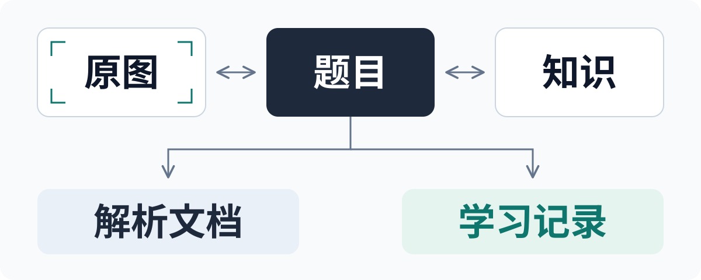

# Study Workbench

**把学习照片整理成可追溯的题目，保留每一次真实作答的历史。**

面向家庭自用的学习工作台：对照原图整理题目与知识，记录作答、评价和复测，再生成练习与 PDF／Word 文档。关闭 AI 也能完成整个人工流程。

[开始使用](#开始使用) · [能做什么](#能做什么) · [验收证据](#验收证据) · [全部文档](docs/README.md)

<p align="center">
  
</p>

关系图展示可回看的来源。解析文档与真实学习记录分别保存：生成答案或完成复习计划，都不会自动认定孩子已经掌握。

## 从一张照片开始

1. **保留原图。** 批量上传照片、调整页序，失败照片单独重试；裁切和去笔迹另存派生版本。
2. **整理题目。** 对照原图选区，补充题干、层级小问、答案和步骤，关联知识、方法与题型。
3. **输出文档。** 生成家长解析或无答案练习；逐题解析支持按题、按讲次或整份合并的 PDF／Word，五册支持 ZIP 下载。
4. **记录真实学习。** 每次作答保留来源、日期与独立评价，复测新增记录，旧内容可以回看。

看不清、来源不明、单位未知和未测保持未知。资料印刷错误、解析订正与学习者错误分别记录，订正保留依据。

## 验收证据

2026-10-05，本机 PC 实现与独立复核均通过。以下对应当前源码及合成隔离实例，运行服务的部署状态单独记录。

| 已执行的检查 | 结果 |
| --- | --- |
| 后端与前端 | 359 项后端、79 项前端，类型检查及生产构建通过 |
| PC 页面与流程 | 58 状态、49 种模板、22 条业务链路；代表页面另验 1280／1920 宽度 |
| 解析与排版 | 两题／两讲、五份文档共 9 页；PDF 与隔离 LibreOffice 的全部 9＋9 页已目视 |
| 配套恢复 | 73 个私有文件及全部模型记录恢复一致，会话重建与拒绝非空恢复通过 |

[完整验收](docs/pc-acceptance-20261005.md) · [独立复核与修复记录](docs/reviews/pc-unification-20261005.md)。不同轮次和专项结果分别记录，不相加为一次全套测试。

## 能做什么

- **资料与知识：** 原图选区、旋转和派生处理、整页分区、拆题／合题，知识、方法、题型与题目双向关联。
- **学习档案：** 笔迹观察、逐次作答、五维评价、订正和复测计划；课堂、提示与独立完成分别记录。
- **解析与文档：** 原图对照、公式预览、层级小问、明确方法版本、五册及逐题／分讲／合集输出。
- **继续整理：** 自动保存草稿、追加历史、版本对照、进行中任务恢复，失败上传与生成可以重试。
- **家庭维护：** 成员权限、可选模型与费用／外发范围、数据保留、帮助及版本记录。

七个入口共用侧栏与主框架：学习总览、资料整理、知识与题库、学习档案、进度与复测、文档中心、设置。具体记录支持直达、刷新和前进／后退；操作步骤见 [PC 使用说明](docs/pc-usage.md)。

## 开始使用

当前为 **0.2.0-dev 开发测试版本**。先在源码目录用 Python 3.12 验证 26 项纯标准库核心契约，不需要数据库或真实照片：

```bash
python3 -m unittest discover \
  -s tests/domain \
  -p 'test_contract_scenarios.py' -v
```

想使用网页，按 [首次本机启动](docs/container-deployment.md#first-local-start)准备 Docker Engine／Compose v2、生成私有配置，启动 Web／worker／PostgreSQL，并交互创建账号及家庭。登录后进入 `http://127.0.0.1:8000/app/`；数据库默认不发布端口，照片、记录、输出和备份保存在私有目录。

Django／PostgreSQL 保存正式数据，React 提供统一 PC 工作台。局域网访问使用 [私有 HTTPS 与 PWA](docs/mobile-deployment.md)，运行配置及账号只在本机设置。

<details>
<summary>开发与离线复验</summary>

将 [requirements.txt](requirements.txt) 安装到项目 `.venv`，准备已缓存的 PostgreSQL 镜像。PC 浏览器复验还需要 Playwright 测试依赖及对应 Chromium 缓存，见 [开发环境](docs/manual-web-contract.md)。按锁文件安装前端并构建：

```bash
cd frontend
npm ci --ignore-scripts
npm test
npm run build
cd ..
```

在项目根目录运行后端及 PC 浏览器验收；只验后端时省略 `--pc-browser`：

```bash
.venv/bin/python scripts/run_persistence_tests.py --pc-browser
```

完整领域目录包含依赖导出库的测试，使用项目 `.venv`，不能把它称作纯标准库测试。配套恢复复验见 [容器说明](docs/container-deployment.md#isolated-synthetic-acceptance)。验证使用虚构数据和自有临时实例，结束后清理自有资源，报告位于被忽略的 `artifacts/`。

</details>

## 当前边界

- PC 实现已推送至 GitHub main，36 已完成配套备份、恢复演练与升级，运行源码为 `136c251`。Git 与运行状态见 [DEV_STATE](DEV_STATE.md)和 [交付记录](docs/repository-handoff.md)。
- AI 默认关闭。真实调用、识别质量、费用和照片外发需按 [模型配置](docs/model-configuration.md)另行核定。
- DOCX 结构和 LibreOffice 排版已经检查；PC／macOS Microsoft Word 实开、Android 真机及完整家庭批次效果仍待实际验收。
- 原照片、个人学习记录、凭据、导出和备份不进入源码仓库。关系图是自编 SVG 文档源码，不含业务图片或运行截图。
- 本项目尚未选择整体源码许可证。固定 companion、第三方组件和字体来源见 [第三方声明](docs/third-party-notices.md)，组件许可不等于项目许可。

## 继续阅读

[全部文档](docs/README.md)保留设计、契约和完整历史索引。常用入口：

- [PC 任务](docs/pc-product-integration-plan-20261005.md) · [解析契约](docs/pc-companion-contract.md) · [PC 使用说明](docs/pc-usage.md)
- [后续任务与交付](docs/pc-follow-up-20261005.md) · [未 push 改动 review](docs/reviews/pc-handoff-20261005.md)
- [数据保留](docs/local-data-policy.md) · [备份与恢复](docs/container-deployment.md)
