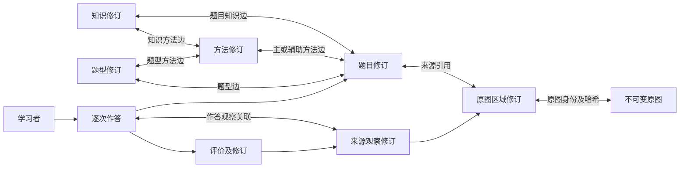

# 核心数据契约草案 v0.1

日期：2026-10-02（Asia/Shanghai）。状态：A0 设计交付由主代理起草及文档复核，未通过独立文档评审。A1a 离线子集已实现并由主代理验证；实际结果与限制以 DEV_STATE 为准，不能扩大为完整持久化契约已实现。以[需求 v0.2](requirements.md)为准；本文件细化现有逻辑关系和失败条件，A0／A1a 不锁定框架；同日 A1b-P 已选择 Django／PostgreSQL，物理子集见[持久化契约](persistence-contract.md)。

## 1. 设计原则与公共字段

知识地图管理内容及关联；学习档案管理具体学习者在具体题目版本上的证据。题目、知识、方法和题型拥有稳定身份，内容变化生成修订；每次真实作答生成新的作答 ID，评价有自己的身份和版本。来源、正确性与独立性分别记录。

- 业务 ID 使用无路径含义的稳定 ID。所有业务对象带 `household_id`；登录账户是操作者，`LearnerProfile` 是学习者，两者不共用身份。所有关联验证同一家庭及对象访问权限，不能只验证 ID 存在。
- 修订公共头：`revision_id`、所属对象 ID、`revision_no`、`previous_revision_id`、`created_by`、`recorded_at`、`origin`（人工／OCR／AI／导入）、`change_reason`、`content_hash`。对象内修订序号唯一，前驱必须属于同一对象；时间统一存带时区的时间值。
- 具有内容或元数据修订的对象保留 `head_revision_id`，需审核发布的对象另有可为空的 `published_revision_id`。前者用于并发修改比较，后者指向最近接受的修订；不可变原图不套用内容发布流程。草稿可含显式缺口，正式可用性由校验和审核决定；页面“当前”是可重建的指针，不删除旧内容。
- 内容修订及证据引用一经保存不可原位改写。审核状态由追加的 `ReviewDecision` 投影得到，可为 `draft`、`accepted`、`rejected`、`stale`、`withdrawn`；投影允许更新，历史内容和决定保持可追溯。修订必须说明改了什么及依据，AI／OCR 不能自行接受。
- `unknown` 是显式值；`null` 只表示该可空字段尚无已知值。空文本、零分、默认日期或 `false` 不能代替未知。已归档对象保留引用；按明确删除动作和保留策略清除个人数据，不作永远不能删除的承诺。

## 2. 实体与基数

下列名称是逻辑契约；A1 可合并通用修订实现，但不能合并不同业务含义或留下未经校验的任意对象引用。

| 实体 | 核心字段与关系 |
| --- | --- |
| Collection／CollectionImage | 资料集稳定 ID、名称；与原图多对多，关联保存页序、来源题号上下文和来源说明；同文件可以有多个来源关联 |
| SourceImage | `image_id`、SHA-256、原文件存储键、实际格式、宽高、录入时间；原图字节不可变，路径独立于 ID；同家庭内相同内容可复用图像身份 |
| ImageDerivative | 指向原图，保存自身哈希、尺寸、处理步骤／参数及版本、输入派生图 ID、坐标变换；不覆盖原图或旧派生文件 |
| Region／RegionRevision | 区域稳定 ID；修订保存原图 ID、原图像素框或多边形、用途、坐标系、可选绘制所用派生版本及变换引用；同图可有多个区域 |
| Question／QuestionRevision | 题目 ID、父题 ID（可空）、原题号／小题号／来源键；修订保存父题修订引用、印刷转写、使用内容、公式块、缺口、来源引用及勘误关联；一题多区域，一个区域可被多题引用 |
| QuestionLineage | 合题／拆题操作的输入题目修订与输出题目修订多对多关系，保存操作 ID、类型、操作者、时间及理由；与题目的父子结构分开 |
| KnowledgeItem／KnowledgeRevision | 知识点或公式的独立 ID；修订含定义、适用条件、公式、易错点、来源和例题引用；不包含某学习者的掌握状态 |
| Method／MethodRevision | 解题方法独立 ID；修订含名称、适用条件、步骤、注意点、来源、可空父方法及版本；对应旧需求的 `MethodTag`，六组是初始方法节点，不是题型 |
| QuestionType／QuestionTypeRevision | 题型独立 ID；修订含名称、结构特征、条件和来源，可人工建立；不以名称字符串充当外键 |
| QuestionKnowledge／QuestionMethod／QuestionTypeLink | 题目修订与知识、方法、题型修订的多对多关联；各边有稳定 ID／修订、角色、依据及审核。方法边区分 `primary`／`auxiliary`；知识边区分考查／例题等角色 |
| KnowledgeMethod／TypeMethod | 知识修订与方法修订、题型修订与方法修订的带类型关联；有来源及审核。与上述题目边共同实现需求的 `KnowledgeLink`，不采用无约束字符串目标 |
| LearnerProfile | 稳定 ID、家长设置称呼、可选年级；不要求姓名或出生日期；家庭内与作答一对多，与账户分开 |
| SourceObservation／ObservationRevision | 原照片或区域上的可见内容记录；修订保存证据、可读性、作者状态、已确认作者 ID（可空）、时间状态、来源说明；可关联题目修订及档案上下文，不强制创建作答 |
| Attempt／AttemptRevision | 一次真实发生的作答及其元数据修订；稳定关系为学习者 ID、实际使用的题目修订 ID、记录类型及可空前次作答 ID；修订保存发生时间、来源类型、独立性、提示、答案转写及观察依据 |
| AttemptObservation | 作答修订与观察修订多对多；保存证据用途、确认者、确认时间及关联理由。同一观察可先独立存在，再关联作答；新增关联不消除未知作者的旧记录 |
| Assessment／AssessmentRevision | 一次评价的身份，外键指向一个 `Attempt`；修订固定此次 `AttemptRevision`、题目修订、参考解析修订和证据依赖，保存分维度判断、步骤依据和未知原因；同一作答可有多次评价及每次修订 |
| SolutionDraft／SolutionRevision | 题目修订的参考答案／解析草稿、检查结果及范围、证据和审核；不与孩子的答案或评价合并 |
| Erratum／ErratumRevision | 资料错误的身份及修订；目标为明确的题目／知识／方法内容修订，保存原文、建议订正、依据、检查范围及审核；与学习者错误无关 |
| ReviewDecision | 固定目标类型、对象及修订、动作（接受／拒绝／修改／撤回）、审核账户、时间、理由、预期依赖版本；“修改”另建修订并关联新修订 ID，不能改旧内容 |
| ProcessingRun／ModelCall | 输入对象／修订／哈希、依赖向量、供应商／模型／prompt／schema／外发配置快照、任务状态、费用及错误；结果先是草稿，依赖变化保留为过期结果 |
| ExportSnapshot／ArchiveManifest | 打印快照或备份清单的独立 ID；保存用途、所用对象及修订、关系边、审核决定、证据及图像哈希、生成器版本和缺口；两个出口见第 7 节 |

`QuestionRevision.parent_question_revision_id` 固定小题依赖的公共题干版本，且其父对象须等于 `Question.parent_id`；拒绝父子环。方法父节点也检查环及同家庭归属。旧编号不能当作全局唯一 ID；父题修订变化不自动改变历史小题或作答。

合题／拆题生成新的题目身份或明确的结果修订，保存输入到输出的谱系；旧题目可归档但其作答与导出引用不迁移或删除。谱系同家庭、无自身引用和循环；跨页来源按结果内容重新列明，不能只依赖一个父题字段追溯合拆操作。

每个内容修订的公式块至少保存表达格式、原文和证据引用。A2 首个公式支持集见[打印契约](export-contract.md)，数据库结构化绑定仍待 B2；不支持的式子保存标注来源的图片回退及缺口，不能静默删式。人工推导的内容注明人工来源及所用题目／检查依据，没有原图时保留来源说明；不能伪造照片。

## 3. 知识、题目与原图的双向追溯

图中的双向箭头代表从同一关联进行往返查询，不保存两份可能不同步的关系。整图级引用允许直接从题目／观察连到原图，明确标为“区域待补”。知识、方法或题型本身还可直接引用原资料作为定义依据。

最小查询契约：

1. `node → 已审核关联边 → question_revision → EvidenceRef → image/region_revision`，结果带所有 ID／修订及缺口。从知识节点可看到题目及原图。
2. `image/region_revision → 引用它的题目、观察与评价 → 题目关联边 → 知识/方法/题型`，从原图可以反查知识和题目；展示边的审核状态。
3. `learner → attempts（每次一个 ID）→ assessments/revisions → observation/evidence`，历史详情使用保存的版本，不能查询“最新题干”替换历史。
4. “当前地图”只选已接受且未撤回的内容与关联；“历史回看”使用事件或导出绑定的版本。节点新修订不会悄悄把旧边迁移至新版本，需人工确认后新建关联修订。

已审核且已分类的题目修订恰有一条主方法边，可有多条辅助方法边；草稿和待补索引可无主分类。题干审核与分类完整性分别显示，待分类题目不能伪称已完成分类。新增题型／方法允许独立 ID，不强塞进六组。同一题目可以关联多个知识点及题型；旧分类迁移时保留原分类名与来源键。

### EvidenceRef v0.1

| 字段 | 约束 |
| --- | --- |
| `image_id`、`image_sha256` | 必填，定位原图及实际字节；检查家庭、访问权限和哈希匹配 |
| `granularity` | `whole_image` 或 `region`，不能用虚构小框表示未知位置 |
| `region_id`、`region_revision_id` | 区域级必填且匹配；整图级为空并注明 `region_missing` |
| `coordinate_space`、`geometry` | 区域级固定 `original_pixels`；框满足 `0 ≤ x0 < x1 ≤ width`、`0 ≤ y0 < y1 ≤ height`，多边形需在界内且非退化；整图级为空 |
| `purpose`、`sequence` | 题干／笔迹／公式／图示等用途及同题跨页阅读顺序；用途不等于作者或独立性 |
| `derivative_id`、`transform_revision_id` | 使用派生图定位时保存已验证的映射依据；证据位置最终仍落到原图，派生图哈希另存 |
| `gaps` | 缺区域、缺上下文、可读性不足等显式缺口；引用有效不等于足以支持结论 |

旋转、裁切的映射在坐标样例中验证正反向；去扭曲等非线性处理需另存可验证映射。映射缺失时只保留整图级来源及缺口，拒绝伪造精确区域。去笔迹图仅用于印刷内容草稿或练习，不可代替原笔迹证据。区域调整生成新修订，已有题目／作答／评价仍指旧区域。

## 4. 来源观察、作答与未知

`SourceObservation` 记录“这张图上看到了什么”。可以登记到某个档案上下文，但 `profile_context_id` 不证明笔迹作者。`ObservationRevision.author_state` 为 `confirmed`／`unknown`；仅确认时允许填写作者学习者 ID，并记录确认人、时间和依据。

`Attempt` 记录“这个学习者确实进行过的一次作答”。`learner_id` 必填；只有家长具有作答归属依据时才创建，无法确认的旧笔迹先留在观察层。观察补证后建立新修订和作答关联，旧观察及未知状态不消失。档案允许保存未知观察，不要求把它转换成作答。

| 作答字段 | 允许值及解释 |
| --- | --- |
| `attempt_kind` | 首次／订正／再做／复测；每次真实事件均新建 ID，`previous_attempt_id` 仅串联历史，必须同学习者且非自身或循环；是否独立另看来源和独立性 |
| `source_kind` | `independent_answer`／`assisted_answer`／`classroom_note`／`copied_work`／`unknown`；家长提供依据，不由 OCR 字段或笔迹存在推断 |
| `independence` | `confirmed_independent`／`not_independent`／`unknown`，与作者状态分开；独立类型不得同时标非独立，课堂／抄录不得标确认独立 |
| `prompt_status`、`prompts` | `none_confirmed`／`given`／`unknown`；提示内容、给出者、时间可记录，未知不得转换为无提示；提示后完成必须非独立 |
| `occurred_at`、`recorded_at` | 实际作答时间可空并标未知；录入时间必填。上传时间不能补作答时间；可保留仅有日期的精度，不伪造具体时刻 |
| `legibility` | `readable`／`partial`／`illegible`／`blank`／`missing`／`unknown`；这是观察事实，不是对错或能力 |

课堂笔记或抄录若确认为学习者的一次活动可建作答记录，但不能成为独立成功；来源不明的观察仍可回看。新作答即使答案同上次相同，也不能被按“学习者＋题目”去重。仅相同录入请求的幂等键可避免重复写入；两个实际事件必须不同键与不同作答 ID。

元数据录错时追加 `AttemptRevision`；如果学习者或实际使用的题目身份录错，撤回原记录并建立显式替代记录，不重写原外键及旧评价。后一次作答、订正后的正确答案或后一次评价都不得替换前一次事件。

“独立成功”只作为有证据支持的查询结果：已确认归属、实际时间已知（符合 AC-09 的历史时间未知边界）、来源为独立作答、独立性已确认、明确无提示、证据充分且人工接受的答案／过程评价支持成功。任一未知、课堂笔记、提示后完成、只有答案正确但过程错误或不足，均不得自动计入。没有成功记录也不等于不会；单次独立成功不等于长期掌握，不建立自动掌握分数。

## 5. 评价、订正与讲义勘误

`Assessment` 只评价一个作答，不是题目上的单一“错因”字段。一次新的评价可新建 `assessment_id`；对同一次评价的编辑则追加 `AssessmentRevision`。必须固定 `attempt_revision_id` 及所有证据依赖，保留 AI 原草稿、家长修改及审核决定。最新摘要可以引用最近有效评价，不能删除或合并旧评价。

分维度至少包含答案、方法选择、可见步骤、计算、符号／表达；各项保存：

- `judgment`：`correct`／`incorrect`／`partial`／`unknown`；允许答案正确而步骤错误。
- `basis_kind`：`observed`／`inferred`／`undetermined`；推测不能显示为已观察事实。
- `evidence_refs`、所评价步骤、简短依据、未知原因及使用的参考解析修订。判断已观察错误需要支持该步骤的可读证据；整图级只有在上下文足够且人工确认时使用，仍提示区域待补。

空白、擦除、看不清、作者未确认或过程缺失时保留相应未知；看见空白可以记为事实，不能由此推断“不会”或“未尝试”。AI 置信度仅是模型元数据，不是孩子能力指标。

资料错误使用 `Erratum`：保留原印刷内容、来源区域、建议订正、确定性检查或其他依据、适用范围及审核。接受勘误可产生新的题目／知识／方法修订，其使用内容与原印刷转写分栏，并引用接受的勘误版本。孩子解题错误则是评价中的错误步骤，二者不能共用一个错误状态。

例如讲义裂项系数有误：接受勘误后生成新使用内容；孩子之前在旧讲义版本上的作答仍绑定旧题目。若原先错因评价受错误参考答案影响，追加并审核新的评价修订，说明勘误依据；不能自动反改孩子历史错误。勘误未定且影响判断时，相关评价保持未知或待复核。

## 6. 审核、并发与旧结果

人工修改请求带 `expected_head_revision_id`；AI／OCR 草稿固定运行时的题目、父题上下文、区域、知识／方法规则、参考解析和配置依赖向量。

一次接受操作的逻辑事务：

1. 检查操作者、家庭范围、目标修订及依赖引用，确认必填内容、缺口和数学检查适用范围。
2. 在同一事务中比较对象头及仍影响此判断的全部预期依赖；不能先读后无条件写入。冲突返回 `version_conflict`，不发布内容。
3. 输入变化的草稿保留结果及依赖，标 `stale`。重新分析或人工新建迁移修订并明确确认当前上下文后，才能重新审核。
4. 校验通过后追加审核决定，更新发布指针及受影响的关联投影，一起提交；失败时无半条正式关联或重复评价。

模型／prompt 更新只使旧缓存不用于新运行，不自动撤销此前人工接受的内容。依赖变更也不会抹掉历史审核；当前使用需显式提示失配或撤回，历史回看仍显示当时版本。纯离线契约校验只能模拟这些规则，数据库原子性、并发和权限需要后续持久化验收。

## 7. 两类导出与导入

**打印／PDF／Word**绑定 `ExportSnapshot`：用途为知识总结、练习或家长答案；包含使用的题目／父题／解析／知识／关联／勘误修订及审核状态、来源和生成器版本。独立复测默认不显示答案、方法分类或题型提示；原图含答案或提示时使用审核后的题干或适当派生材料，无法排除提示则提示缺口并阻止把它标为独立材料。该输出不是数据库备份。

**数据备份／恢复**绑定 `ArchiveManifest`：含 `schema_version`、备份 ID、家庭范围、全部实体 ID／修订／关联／审核记录、图像与派生文件清单及哈希、来源缺口、导出快照元数据、归档／删除记录及恢复点。密钥不导出；模型原始响应是否包含按保留策略说明，不能擅自扩大留存。

- 空实例恢复时先验证文件哈希、字段版本、对象归属及引用闭包，再写入；目录重定位不改变 ID。缺文件或关系拒绝成为“恢复完成”，可留明确的待修复状态。
- 同备份包重复导入按稳定 ID／修订／来源键幂等。相同 ID 与不同内容哈希是冲突，不能静默覆盖；相同文本但不同原题／作答身份不自动合并。
- 原图按哈希复用，但新增资料页关联仍保存。旧索引按“导入来源命名空间＋原索引键”防重复，不凭题干前缀合并；已有 81 条只有索引的记录保留缺题干／缺区域状态和整图引用。
- 恢复验收核对实体、版本、关系与文件数量及哈希，而非只验证页面能打开。恢复点之后的删除日志需另行核对；缺失时先由家长处理，不宣称旧包知道后来删除了什么。

## 8. 合成契约场景与验收映射

下列 CT 编号是契约样例，不新增 FR／AC。A1a 只验证离线子集，实际结果见 DEV_STATE；使用虚构图像元数据、虚构称呼和文本，真实图片及旧 81 条导入另在获授权的任务验证。

| 场景 | 应得到的结果 | 对应验收 |
| --- | --- | --- |
| CT-01 知识／方法／题型各连两题，其中一题跨两页 | 从节点到题目到两张原图，再从原图反查节点，ID／修订／阅读顺序一致；草稿边不混入正式地图 | AC-02、AC-05、AC-10、AC-21、AC-22 |
| CT-02 同题先提示后错答，再独立复测正确；修改首次评价 | 两个作答 ID，两个评价身份；首次评价保留原版及订正版，后次不覆盖任何前次；只有满足证据条件的第二次支持独立成功 | AC-09、AC-23、AC-24 |
| CT-03 课堂笔记、抄录、来源不明、空白、看不清、日期未知 | 分别保留来源／可读性／时间状态，无依据不得建作者确认或独立成功；未知观察可以留在档案 | AC-04、AC-09、AC-14、AC-23、AC-24 |
| CT-04 答案对但过程错或无过程 | 两个维度分别保存，不从答案自动推出过程正确或掌握 | AC-23、AC-24 |
| CT-05 讲义勘误和孩子计算错同时存在 | 勘误与评价独立；原文、订正依据、旧题目及旧作答保留；复核评价产生新版 | AC-07、AC-23 |
| CT-06 区域旋转后调整，旧分析迟到；旧审核页接受 | 旧区域／草稿保留，新区域不被覆盖，版本冲突不能发布 | AC-02、AC-15 |
| CT-07 错家庭、错哈希、越界／退化框、错区域版本 | 返回具体引用错误；坐标未知只允许合法整图引用和缺口，不造精确框 | AC-06、AC-10、AC-16 |
| CT-08 导出／恢复合成关系包并重复导入 | ID／内容／边／审核历史一致；重复导入数量不增；同 ID 异内容冲突被拒绝 | AC-12、AC-17 |
| CT-09 旧索引缺题干与坐标，新方法尚未分类 | 留 `missing_fields` 和区域待补，不能标完整已审核；六组不是新方法的强制全集 | AC-03、AC-05 |
| CT-10 后续元数据补证或发现作者录错 | 未知观察旧版本保留；补证有确认者和依据；错身份撤回并显式替代，不改变旧评价外键 | AC-04、AC-09、AC-24 |

合成场景不能证明真实图像哈希、数据库事务、OCR 效果、81 条来源完整性或实际打印版式。后续持久化／导入／渲染任务分别执行这些验收，不把离线契约测试等同于 M1a 完成。

## 9. 待确定项与下一任务

A0 当时待细化的物理表、迁移及依赖版本已在 A1b-P 落实子集；A2 的首个公式支持集和本机打印快照见[打印契约](export-contract.md)；坐标非线性映射、真实存储位置及保留／删除规则仍待后续任务。供应商与费用配置不妨碍离线契约；实际外发仍需另行实施并验证。

A1a 阶段已实现并验证：框架无关的核心契约、关系校验、合成场景及 JSON 往返，不搭 Web 或接 AI；文件、输入输出及验收见[实施分工](implementation-plan.md)。同日用户分别同意 A1b-P 持久化与审核事务、A1b-I 旧索引导入；采用 Django／PostgreSQL，实际范围与结果见[导入契约](legacy-import-contract.md)及 DEV_STATE。

### A1a 离线实现与完整设计的边界

离线代码入口为 [app/domain](../app/domain/__init__.py)。`Bundle` 使用 `study-workbench.core.v0.1` schema，封闭保存原图元数据、矩形区域修订、知识／方法／题型及各自到题目的关联、题目父子版本、学习者、来源观察、逐次作答、评价和题目勘误。记录使用不可变类型、稳定 ID、修订链及内容哈希；它是交换和验证模型，尚无持久化写入服务。

`validate_bundle` 校验引用闭包和关系；`questions_for_node`、`questions_for_evidence`、`nodes_for_evidence` 验证节点、题目与原图的双向追溯。`independent_successes` 只返回有当前作答版本评价、作者确认、可读证据、已知日期及无提示依据的独立成功事件，不生成掌握分数。课堂、抄录、提示后完成及未知保留各自状态；明确冲突的已审核评价不计成功。同一次作答固定实际使用的题目修订，身份错误通过撤回和替代处理；资料订正与孩子错误分别保存。

`serialize_bundle`／`deserialize_bundle` 验证带类型的 JSON 往返；`merge_bundles` 只合并两个完整关系包，按稳定 ID／修订拒绝异内容冲突。包中的图像哈希是虚构元数据，不读取或校验真实图像文件；这不构成第 7 节的备份或恢复实现。`compare_expected_version` 比较调用方提供的完整依赖向量，返回 `current`、`stale` 或 `version_conflict`；不能保证调用方列全依赖，也没有数据库原子事务。

本子集中的 `review_state` 和 `reviewed_by` 是输入快照，未实现第 1／6 节的追加 `ReviewDecision`、审核者权限、状态转换或原子发布；接受状态不代表程序已经执行了人工审核。尚未编码资料集／页序关联、派生图与旋转映射、合拆谱系、知识到方法及题型到方法的直接边、解析草稿、分析／评价运行、打印快照、完整归档清单及删除日志。知识／方法勘误只保留目标引用，生成订正内容的直接关联本轮仅覆盖题目；这些差距不能由合成 CT 通过替代。实际验证结果与下一阶段范围见 [DEV_STATE](../DEV_STATE.md)。

### A1b-P 持久化实现的衔接

A1a 上述限制保留为该阶段的历史边界。A1b-P 追加实际 ReviewDecision、家庭权限、状态投影与原子发布，原快照和哈希不改写。领域默认离线语义保持；持久化显式关闭快照审核资格校验，引用完整性仍检查，实际接受资格在审核事务验证。物理关系、审核游标、完整依赖和仍缺的实体见[持久化契约](persistence-contract.md)，运行结果见 DEV_STATE。历史 JSON 内容包仍不等于完整数据库归档。

### A2 离线打印的衔接

A2 的 `study-workbench.print.v0.1` 是与框架无关的完整内容输入快照；历史来源为文档 JSON 字节 SHA，统一 `legacy_unreviewed`，不冒充人工发布。生成器、字体、用途及输出哈希绑定在私有文件快照，后续新版本不覆盖旧输出。B2 仍须由数据库已审核修订及权限构造输入、绑定题目／关联／勘误及来源区域；本轮没有新增数据库 ExportSnapshot 表或完整 ArchiveManifest。支持范围、回退与验收见[打印契约](export-contract.md)。
