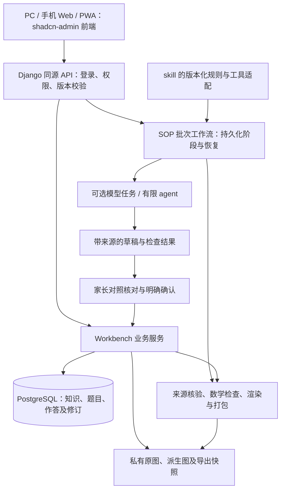

# SOP、可选 agent、shadcn-admin 与 Workbench 融合技术方案

2026-10-05 设计补充：用户确认原“更多工具”应归入左侧业务导航，页面在统一主框架内操作。新增 [PC 统一与 skill 页面化方案](pc-product-integration-plan-20261005.md)细化原逐页替换目标、普通用户文案及逐题／分讲／合集解析任务。skill 新模块已有本地源码提交 `72e9a3d`，尚未接入 Workbench；此轮仅方案和文档更新，不能将下方原有融合验收记作全部 PC 页面统一完成。

> 本文保留最初只读选型与技术方案的证据快照，不将历史“当前尚未实现”写成最新状态。2026-10-04 已按本机实现、review、统一提交／手动 push、36 备份恢复升级完成有界核心：新前端、进度／计划、完整 skill records 与配对教学图、人工核对五册流程。真实两题小样通过，运行版本为 0.2.0-dev。最新范围、旧 formula_image 明确拒绝及人工未验项见 [实施任务](fusion-execution-20261004.md)、[skill 完整接入](skill-integration-completion-20261004.md)和 [DEV_STATE](../DEV_STATE.md)。下述矩阵是选型时差距，不替代实际交付回执。

日期：2026-10-04（Asia/Shanghai）。原方案阶段为文档设计；随后用户授权按清单连续本机实施、Luna6 分工与主代理验收。当前实现和范围见 [融合实施任务](fusion-execution-20261004.md)、[API 契约](fusion-api-contract.md)、[工具交换契约](skill-exchange-contract.md)。本文下方保留设计时证据和后续阶段，不代表未来移动客户端、真实外发、Git 交付、NAS 或 36 部署自动获授权。

## 1. 决策与证据范围

采用 **Workbench 业务后端＋shadcn-admin 渐进前端＋SOP 工具／工作流＋可选有限 agent**。对家长交付一个工作台，两个项目的成果通过版本化契约衔接；Workbench 保存正式知识、题目和学习记录，离线 skill 继续可独立使用。

如果只需要照片到文档，skill 更接近原来的整理方式；需要知识检索、历次作答、订正、复测和长期统计时，系统承担持续管理。agent 用于减少转写、归纳和编写工作，不是系统运行的必需依赖。关闭模型后，人工录入、确认、查询、作答记录和导出仍能完成。

本轮证据：

| 来源 | 检查点与范围 | 不代表什么 |
| --- | --- | --- |
| Workbench | HEAD `ecd33622f9ed359e3b245446a1285326e02e1837`；同时读取当前未提交工作树、README／DEV_STATE、需求、学习服务、AI 与五册入口 | 新增功能不因本机实现而成为 36 已部署功能；本轮未重跑应用测试 |
| study-material-workflow | 初读 HEAD `09a1ac579df8b9f875ac1e4e0a944c2ed620500c`；只读核查结束时并行会话已提交 `c61214415cc788adfb60a5174dc5e050b49d61f1`，新增数论和验收记录 | 本轮未修改该项目；数论真实批次的内容／输出未由本轮复验，不能扩大为融合系统已验 |
| shadcn-admin | 固定上游提交 `e16c87f213a5ba5e45964e9b67c792105ec74d26`，package 版本 `2.2.1`；只读检查依赖、认证、用户与图表源码 | 未安装或运行；项目兼容性、性能和改造工期尚无实测 |

需求继续为 18 FR／6 NFR／24 AC。v0.1 的 Luna 独立评审与 v0.2 的主代理补充复核保持原有区分；本方案未做新的独立评审。实际工程状态以 [DEV_STATE](../DEV_STATE.md) 为准，旧阶段评估不改写成最新实现状态。

并行会话新增的 skill `docs/session-and-holdout-acceptance.md` 记载：数论真实新批次为 3 图／8 大题／12 条目／14 节点、五册 18 页；内容／数学和全部 PDF 页已核对，Codex CLI 四个新 thread 的触发／不触发／继续行为已记录。本文只读核对该记录及源码变化范围，没有重新读取原图或复验成果；桌面／IDE 发现、PC／macOS Word 实开、真实供应商与 Workbench 数据库接入仍未验。此更新替代初读时“数论参考尚未提交”的状态，不影响下述工具接入与架构边界。

## 2. shadcn-admin 的真实边界

这个仓库提供后台管理 **前端 UI**：React／TypeScript／Vite、shadcn 组件、路由、查询状态、表格、表单和图表。它没有可接管 Workbench 题库、学习档案和审核历史的业务后端。[固定依赖](https://github.com/satnaing/shadcn-admin/blob/e16c87f213a5ba5e45964e9b67c792105ec74d26/package.json)

默认登录用延时模拟成功并写入模拟 token；用户列表由 Faker 生成，用户编辑提交仅展示表单数据；统计示例使用随机数。这些不是数据库持久化、服务端认证或学习统计。[登录实现](https://github.com/satnaing/shadcn-admin/blob/e16c87f213a5ba5e45964e9b67c792105ec74d26/src/features/auth/sign-in/components/user-auth-form.tsx)、[用户数据](https://github.com/satnaing/shadcn-admin/blob/e16c87f213a5ba5e45964e9b67c792105ec74d26/src/features/users/data/users.ts)、[用户编辑](https://github.com/satnaing/shadcn-admin/blob/e16c87f213a5ba5e45964e9b67c792105ec74d26/src/features/users/components/users-action-dialog.tsx)、[图表](https://github.com/satnaing/shadcn-admin/blob/e16c87f213a5ba5e45964e9b67c792105ec74d26/src/features/dashboard/components/overview.tsx)

依赖中的 Clerk SDK 是外部认证集成能力，不等于自带完整业务后端。家庭版本沿用 Django 用户名／会话、家庭归属和 owner／reviewer／viewer 权限；学习者可以没有登录账号。复用时保留 [MIT 声明](https://github.com/satnaing/shadcn-admin/blob/e16c87f213a5ba5e45964e9b67c792105ec74d26/LICENSE)，后续实施再冻结锁文件、构建环境及所选组件的第三方声明。

## 3. 逐项功能融合评估

“已有”指当前源码及既有验收记录，不表示本轮重测、真实模型有效或服务已升级。完整需求依据见 [产品需求](requirements.md)，SOP 依据见 [原始对照](sop-implementation-assessment-20261004.md)。

| 需求 | skill 的适用部分 | Workbench 的适用部分 | 融合决定 |
| --- | --- | --- | --- |
| FR-01 上传与清单 | 选定文件、实际解码、哈希、数量核验 | 网页上传、页序、去重、私有来源 | 系统作为入口，复用批次核验规则 |
| FR-02 区域与派生 | 保存来源；缺精确框时保留整图和缺口 | 区域、旋转映射、派生修订、合拆追踪 | 系统保存精确区域和历史 |
| FR-03 题目／小题版本 | 索引、父子、左右、跨页、raw 保留 | 正式题目及追加修订、确认、查询 | 工具准备草稿，系统维护身份与版本 |
| FR-04 印刷／手写来源 | agent／人工阅读与观察规范 | 印刷、课堂、提示、独立、未知分开存储 | 统一规则，观察与真实作答分层 |
| FR-05 分类／地图 | 专题分类、主辅方法、成套总结 | 分类树、类型化关系、双向查询 | 内容归纳与关系管理分别承接 |
| FR-06 AI 草稿 | 内容由 agent／人工编写，无模型任务服务 | 配置、提案、引用校验和核对入口 | 保留 provider 服务；SOP 形成版本化任务规则 |
| FR-07 数学／勘误 | 精确算术、专题约束、诊断回归 | 有限算术、勘误、审核与依据 | 统一检查范围；讲义错误不写成孩子错误 |
| FR-08 PDF／Word | 五册 packet、全页预览、配方／字节核验 | 业务导出、五册、ZIP、教学图 | 先统一输出契约和兼容测试，再共享组件 |
| FR-09 逐次作答 | 文档与家长记录模板 | 独立事件、订正／重做／复测及评价修订 | 系统承担正式记录，不从照片自动造 Attempt |
| FR-10 检索回看 | 按文件、批次、清单定位 | 按知识、题型、日期、错误及来源检索 | 系统作为长期检索入口 |
| FR-11 模型／任务／费用 | 阶段状态、失效和继续运行；无真实费用服务 | 队列、取消、用量、预算及未知费用 | 后端控制任务，吸收工具阶段恢复规则 |
| FR-12 备份恢复 | 成果版本、ZIP、发布回执和哈希 | 数据库／文件联合恢复、关系与修订 | 成果归档与业务备份分别验证 |
| FR-13 变式／排期 | 人工／agent 编写材料 | 变式来源、审核门槛、计划及完成事件 | 工具辅助编写，系统安排并跟踪 |
| FR-14 学习汇总 | 可打印证据报告 | 作答、未知、重复错误与日期间隔报告 | 后端定义指标，前端提供总览 |
| FR-15 知识条目 | 知识卡、公式条件、方法步骤 | 独立条目、来源、修订与题目关联 | 内容草稿进入系统，知识与题目分别维护 |
| FR-16 关联索引 | 专题命名空间、方法映射 | 知识／方法／题型独立 ID、多对多 | 系统保存权威关系，不以文档标题作身份 |
| FR-17 过程评价 | 五维规则与人工／agent 草稿 | 精确作答版本、维度依据、未知与评价历史 | 同一语义；评价只绑定指定实际作答 |
| FR-18 学习档案 | 无跨批次学习者业务数据库 | 档案、历次事件、订正与复测关系 | 系统承担长期档案 |

当前接入尚不完整：skill 的 `export_workbench.py` 从 sources／catalog 中的 raw 旧索引构造草稿 bundle，没有把 `packet.json` 的五册正文、知识卡、答案和真实学习事件完整写入数据库。完整几何还存在未知辅助方法映射，不能自动丢弃或猜归属。此处是后续接入任务，不能把纯导出标为正式入库。

打印副本来源记录在 skill 的 `docs/print-component-provenance.json`。本轮按字节比较，双方当前 `contracts.py`、`renderer.py`、`fonts.py` 不同，`math.py`、`rich.py` 相同。不同内容本身不证明缺陷；应先明确文档用途／图示／字体接口，建立兼容测试，稳定后提取一个版本化纯 Python 打印组件。两个项目通过适配使用它，不能盲目覆盖任一副本。

## 4. 哪些功能需要 agent

Skill 包含工作指引、参考规则和机械工具；它不是可自动放进容器运行的 agent 服务。当前阅读和内容编写由调用它的 agent／人工完成。系统化需要将这些规范映射为任务输入、草稿输出、工具权限和确认节点，而不是让服务器执行任意 SKILL.md 指令。

本文使用：workflow 表示代码确定阶段，agent 表示模型在限定任务内选择处理步骤或工具。这个区分参考 [Anthropic 工程说明](https://www.anthropic.com/engineering/building-effective-agents)；采用哪种方式是本项目的设计判断。

| 功能 | 默认执行方式 | agent 是否必需 |
| --- | --- | --- |
| 上传、哈希、页序、身份、权限、版本 | Django／确定性工具 | 不需要 |
| 题干／公式转写、区域候选 | 人工；启用后调用 OCR／视觉模型 | 模型可降低工作量；单次模型调用也能实现，不必自治编排 |
| 知识归纳、分类、解析、变式 | 人工或结构化模型草稿 | 可选；复杂材料再评估有限 agent 的收益 |
| 数学复算、资源校验、排版、ZIP | 受限确定性工具 | 不需要 |
| 核对内容、确认作者／提示／实际日期 | 家长明确操作 | agent 不能代替确认 |
| 作答保存、统计、检索、备份恢复 | 后端业务服务 | 不需要 |

默认选择已有 provider＋固定 Python／数据库工作流。先验证单次结构化调用和确定性校验，出现可测的收益后再增加限定分支；当前不引入 LangGraph、Dify、多 agent 辩论或通用自治平台。SOP 参考按阶段提供给模型，不把整套开发代理的 shell／文件权限搬进运行服务。

评估时 AI 为题目、知识、评价、变式四种任务。本轮 [核心补齐契约](fusion-completion-contract.md)新增第五种 material 资料内容草稿：仍为单次外部请求、最多四个受控工具请求；一个资料批次累计最多四次请求（含失败、取消、重做）、600 秒，另受模型配置全局调用数与美元预算约束。分类／解析不是额外运行类型。旧 [可行性评估](llm-agent-feasibility.md)中的 6 请求／8 工具属于早期提案，不是当前运行限额；没有新增通用自治 agent 平台，真实模型按用户安排后续手动配置测试。

## 5. 产品流程重设计

### 5.1 导航与首页

主导航为总览、资料整理、知识题库、学习档案、文档与复习；模型、成员、预算、保留与备份进入设置。单家庭免重复选择家庭，多个学习者可切换档案。首页显示待核对、待重拍、待复测和最近成果，每项可以回到具体内容。家长不用填写数据库 ID、请求键或内部版本号。

### 5.2 照片到文档

1. **上传／选择资料**：确定专题、页序、所需册别；文件问题逐项提示。系统保留原字节；派生图有单独记录。AI 未配置时直接进入人工模式。
2. **整理并核对**：后台准备来源、阅读／转写候选、知识和解析草稿。对照原图显示题目、理论栏、手写观察及待补项；定位到有疑问的字段，允许只返工相关阶段。整页未读、待重拍和来源不足保持可见。
3. **确认内容**：家长明确确认所核对的版本；保存、应用提案和确认由后台衔接。现有一次确认与事务语义保留。后续批次确认只接收家长明确选定且逐项已核对的清单；未实现前沿用逐项确认，不将“下一条”导航称为批量审核。
4. **生成并检查五册**：选择知识总结、分类索引、证据评价、无提示复测、家长答案，可注明不适用册别。全部来自固定内容快照；独立卷另行构造，文字、标题和图示均不泄漏提示。没有实际学习证据时显示待测，不强造评价。
5. **下载／归档**：预览所有输出页，记录版式检查；下载 PDF／Word／ZIP 与清单。内容确认和版式确认分别绑定版本。NAS 正式发布是独立任务；本地下载成功不显示为远端已交付。

内容确认、无提示检查与版式检查保留，但模型任务、草稿搬运、幂等键和版本绑定由后台执行。已确认且输入未变的结果可复用；来源、内容、图示、字体或渲染器变化使相关确认／验证失效。未确认草稿可以预览并标为草稿，不能冒充正式题库或已验成果。

### 5.3 作答、订正与复测

从题目或学习档案录入真实发生的一次作答，记录实际日期、原图证据、课堂／提示／独立／未知来源。订正、再做及延时复测创建新的事件并关联此前记录；每次评价固定具体作答修订。理论笔记和来源不明笔迹先记观察，不自动转成孩子错误或独立成功。讲义勘误走资料订正链，孩子错误走作答评价链。

## 6. 技术架构与选型

下图保留评估阶段目标设计。当前同源 API、固定资料工作流与 React 前端已实现，核心补齐与实际验收见 [执行记录](fusion-execution-20261004.md)；旧 skill 图示资产自动生产、真实模型和外部交付仍须分别验收。

| 层 | 选择与职责 | 复用／新增边界 |
| --- | --- | --- |
| 前端 | React／TypeScript／Vite／shadcn；TanStack Router／Query／Table，Recharts | 选取上游布局与组件，定制学习页面；删除模拟认证、随机指标及提交调试展示；Node 与锁文件在实施时冻结 |
| API | Django 5.2 LTS 的薄 JSON 接口，调用已有业务服务 | 先完成只读接口和稳定响应；不为了第一版同时引入额外后端框架。覆盖扩大后再评估 API 框架收益 |
| 业务与持久化 | 已有 Django／PostgreSQL 16、领域契约和审核事务 | 正式数据只有一个权威来源；React 和 agent 不直接写数据库 |
| 工作流 | 复用现有独立 worker、数据库领取任务；扩展批次／阶段持久化 | 固定依赖、失效、恢复、取消及回执；默认不新增 Redis、队列集群或独立 agent 服务 |
| AI | 已有可替换 provider、配置版本、受控工具和预算 | 模型默认关闭，手动配置；真实外发与费用测试另行执行 |
| 打印工具 | 来源核验、有限数学工具、版本化纯 Python 渲染能力 | 先适配，再按兼容验收结果共享；支持范围、字体与实际版式分别验证 |
| 交付 | Docker Compose：Web、worker、PostgreSQL、Caddy | 前端构建产物同源提供，Node 只用于构建；私有资料放持久卷，继续使用家庭 HTTPS |

已有 [证据报告 JSON](../app/study/urls.py)与上传等局部接口；还没有供新前端接管全部业务的 API。拟新增 `/app/` 前端和 `/api/v1/` 接口，与旧页面并行。先迁移只读总览和记录列表，再迁移写入；旧路由保持回退入口，核验后逐页切换，不能仅替换模板并认定业务已接通。

同源认证继续使用 Django 会话、HttpOnly Cookie 和 CSRF；API 校验家庭、角色、对象、精确版本与幂等。前端不使用模拟 token 或持久保存私有查询缓存；登出／家庭切换清理内存查询，查询键包含家庭与学习者。API、照片、答案和导出不进入 PWA 缓存，静态服务器只公开构建资源，不将私有卷作为静态目录。

## 7. skill 接入与 API 草案

以下为原评估阶段拟议契约；当前字段、路由、错误语义已冻结在 [融合 API](fusion-api-contract.md) 与 [工具交换](skill-exchange-contract.md)，不把原示例等同运行接口。主代理在 FUS-01 冻结具体字段及错误语义，沿用 [核心关系](core-data-contract.md)、[持久化](persistence-contract.md)、[业务](business-web-contract.md)和[打印契约](export-contract.md)，不能用新壳绕开已有约束。

### 7.1 工具与正式数据

工具适配接收显式来源／内容快照和版本化配方，返回 JSON 草稿、检查报告或私有成果句柄。固定工具源码与依赖；模型无法提供任意脚本、模块名、路径、URL 或 SQL。运行服务通过已有业务服务完成正式写入。

| 交换内容 | 必须保留 | 正式写入边界 |
| --- | --- | --- |
| 来源清单／页面阅读 | 原图 SHA、原始尺寸、确切资料页、显示变换、区域修订、缺口 | 后端授权来源；同一原图复用到不同页不能混淆 |
| 题目草稿 | 原题号、父子、左右、有序跨页、印刷原文／工作文本、公式／图示和来源 | 临时 ID 到正式 ID 显式映射；哈希相同不自动证明是同一题 |
| 知识／方法／题型草稿 | 各自身份、条件／步骤、出处、主辅角色及精确题目修订 | 追加条目和关系修订；保留专题命名空间及未知映射，新专题须显式适配而不默认套旧计算 |
| 观察／作答／评价 | 作者、日期、提示、可读性与未知；评价目标作答及证据 | 观察不自动建作答；导入真实事件须显式选择；评价不覆盖前次 |
| 家长答案／讲义勘误 | 原题版本、解答、检查范围、原文及依据 | 与学习者答案和错误评价分别保存 |
| 五册内容／成果 | 用途、内容修订、资源 SHA、公式／图示、配方摘要、审核及输出检查状态 | packet 的人工 pass 不直接转换为业务 ReviewDecision；内容和权限重新校验 |

草案封装需包含 `schema_version`、`job_id`、家庭与来源范围、输入修订／摘要、工具／规则版本、分阶段输出、检查和缺口。服务端据当前成员权限决定可用范围，不信任封装自报的家庭或审核状态。重复输入与请求键返回同一回执；冲突不覆盖，失效结果保留为过期草稿。

离线的 sources／catalog／packet／run 继续用于 portable 文件交付；在线批次状态保存在数据库，`run.json` 是交换快照，不能与数据库分别修改后都声称为正式记录。

### 7.2 前端接口

| 接口组（拟新增 `/api/v1/` 前缀） | 输入／输出 | 约束 |
| --- | --- | --- |
| `session`、`households`、`learners` | 会话／角色、授权家庭与学习者选择 | 未登录拒绝，登录和退出沿用会话语义 |
| `learners/{id}/overview`、`attempts` | 实际日期区间、来源类型、分页 → 指标、次数／题数、记录与证据链接 | 返回口径版本、样本数与未知；不暴露其他家庭 |
| `materials`、`questions`、`knowledge` | 资料／节点／题号过滤 → 当前内容、历史入口、来源和缺口 | 稳定 ID 与内容修订分开；权限与版本在服务端验证 |
| `processing-jobs` | 选定资料页／区域、专题及模式 → 阶段、待补、模型用量与取消状态 | 创建幂等，GET 不启动任务；模型关闭有人工入口 |
| `proposals/{id}/confirm` | 明确选择、确认依据、精确输入上下文和请求键 → 内容／确认回执 | 过期返回可理解的冲突；不静默覆盖，不由 agent 调用批准 |
| `print-packets`、`deliveries` | 固定内容修订、用途与目标 → 预览、下载及交付回执 | 生成、检查、下载与 NAS 发布分别记状态 |

不沿用上游演示中的商业用户角色、客户端随机数据和假登录。首个切片不需要实现上述全部路由；只实现会话／选择、总览和分页记录。

## 8. 工作流、预算与恢复

拟新增批次任务与阶段记录，关联已有 ModelRun、提案、内容修订和 ExportSnapshot；不把模型“运行成功”当成内容已确认或交付完成。

处理阶段为来源准备 → 页面阅读／转写 → 内容归纳与检查 → 待内容核对 → 固定快照／渲染 → 待输出检查 → 可下载。每阶段保存输入摘要、规则／模型配置版本、输出、失败与依赖。人工等待不占 worker；恢复核对已完成步骤，不自动重发全部模型请求。实际步骤按人工／AI 模式和所选册别裁剪。

工具执行后得到的数学检查只表示支持范围内的结果；步骤来源、内容正确与教育判断分别存储。原图缺失、未知作者和模糊笔迹显示待补，不能用模型置信度生成掌握判断。

预算预留和发送前复查由后端执行。取消未发送阶段可以释放预留；已发送且结果未知保留未知状态，不盲目重试或承诺绝不重复计费。新增批次控制需汇总所有子任务费用与调用，不仅看每个 ModelRun。具体限额、超时、并发和返回错误在实现前冻结，不由 agent 自行提高。

## 9. 前端逐页替换与学习统计

| 页面／功能 | 复用程度 | 迁移设计 |
| --- | --- | --- |
| 导航、侧栏、主题、布局 | 高 | 学习任务导航及中文文案 |
| 总览卡片／图表 | 界面高，数据需定制 | 后端统计，保留空值／未知和明细入口 |
| 题库列表／筛选／分页 | 高 | 服务端过滤，主辅方法、题型、来源及确认状态 |
| 档案／作答时间线 | 部分 | 按实际事件组织，展开每次修订／评价及原图 |
| 复习计划 | 部分 | 任务列表接现有计划，完成必须关联实际作答 |
| 成员／登录 | 仅部分界面 | 家庭角色及用户名登录，删除模拟认证与调试提交 |
| AI 整理／内容核对 | 需定制 | 原图与内容并排、待补清单、明确确认；不暴露内部搬运步骤 |
| 原图／区域／旋转 | 需定制 | 保留整数像素映射与历史，验证 PC 与手机触控 |
| 知识树／方法关系 | 部分 | 复用交互组件，系统维护独立实体和双向索引 |
| 五册／预览／下载 | 仅界面 | 调用原有渲染服务，保留用途、资源与内容版本 |
| 设置／任务状态 | 部分 | 显式配置和失败原因，密钥留在服务端 |
| PWA | 需接入验证 | 使用同一 Web 服务，延续私有数据不缓存；不自动成为原生 App |

后端已有 [证据报告](../app/study/services.py)和[独立成功判定](../app/web/learning_services.py)。总览需另行定义聚合和接口；图表只是呈现，不能生成业务事实。

| 指标 | 拟议口径与证据 |
| --- | --- |
| 整理进度 | 已阅读／待重拍页、题干／区域缺口和已确认题；上传完成不等于整理完成；人工分区不证明自动覆盖全图 |
| 活动记录 | 题目按稳定 ID 去重，作答按真实事件计次；同次多个评价修订不重复计次；课堂、提示、独立、未知分别列出 |
| 独立作答表现 | 先冻结可判定独立样本的资格及分母；答案正确与符合现有独立成功条件分别展示，未知／缺评价单列；样本为零显示未测，不报 0% 掌握 |
| 订正闭环 | 原错误 → 订正 → 后续独立复测及对应评价；提示后做对不直接闭环，后次成功保留前次错误 |
| 知识点证据 | 已观察正确、重复错误、尚未测与不足；允许按题目／知识／题型展开，不能从课堂笔记推断掌握 |
| 复习计划 | 待做、逾期、完成和关联作答；不以点击按钮代替实际完成 |
| 日期与耗时 | 确认的实际日期用于趋势；未知日期单列，录入／上传时间单独显示；整理人工耗时与学习时长分别定义 |

每个指标返回统计时间、范围、口径版本、分子／分母或计数、排除／未知数及证据入口。首切片先提供已有证据的计数与明细；资格分母未冻结的比例返回未提供，不先编造百分比。当前报告与历史快照分开，修订不能改变已导出的历史报告。

## 10. 分阶段实施、所有权与验收

以下为 FUS-00 评估阶段任务设计；随后已获本机 FUS-01～07 实施授权，实际完成状态见 [执行记录](fusion-execution-20261004.md)，外部发布边界保持。每次实施按当次范围授权，一个 luna6-worker 承接有界模块，主代理负责共享契约与最终独立验收；先冻结契约，再开始依赖它的代码。

| 编号 | 范围与负责人 | 输入 → 输出 | 验收／前置 |
| --- | --- | --- | --- |
| FUS-00 | 主代理：本方案及入口／状态／路线文档 | 两项目和上游证据 → 逐项结论、方案和边界 | 文档事实、相对链接、FR／NFR／AC 计数及实际改动范围；本轮无新运行验收 |
| FUS-01 | 主代理：拟新增 API／工具交换契约、统计口径与匿名样例 | 已有领域服务、SOP 快照 → 请求／响应、身份映射、错误、预算、配方与接口冻结 | 区分观察与实际作答；过期／重放／未知／跨家庭反例；无隐式迁移或真实外发 |
| FUS-02 | 首切片；主代理 API，Luna6 前端总览／记录 | 冻结只读接口、匿名夹具 → 同源登录、学习者选择、总览和分页记录 | 见下节；通过后才扩到写入页面 |
| FUS-03 | 主代理接入；Luna6 可拥有单一纯转换模块及其测试 | sources／catalog／packet／ledger → 完整草稿及映射报告 | raw 与原图 SHA 不变，未知不丢，稳定身份、重复输入、知识↔题目↔原图；正式入库另验 |
| FUS-04 | 主代理有限 AI 编排；Luna6 可拥有冻结范围内的阶段模块 | SOP 规则、选定来源、现有 provider → 可恢复任务和有依据提案 | 模型关闭、人工回退、取消／迟到／预算／过期；先合成，真实效果与费用按手动配置范围另验 |
| FUS-05 | 资料核对／五册前端及共享打印兼容；主代理集成 | 已确认内容与资源 → 简化核对、五册预览／下载 | 同题版本固定、无提示、全部 PDF 页、Word 结构与实际客户端分项验；变化不沿用旧 pass |
| FUS-06 | 档案／订正／复测、复习和统计完善 | 真实事件及评价 → 时间线、证据指标和计划 | 多次不覆盖、五维未知、实际日期、勘误分离、指标可反查；家庭学习效果单独观察 |
| FUS-07 | 主代理：统一源码交付、容器升级；NAS 为另一个发布子任务 | 已审查源码、镜像和备份 → 运行验收与恢复点／交付回执 | 文档与源码 review 后按安排统一 push；36 备份恢复／迁移／业务验收另行授权；NAS 暂存、断线、冲突和全字节另验 |

FUS-03、04、05 有接口依赖，不作为三个自由修改共享文件的并行任务。独立后端与前端工作可以在冻结接口后并行。未来 worker 必须收到：明确文件所有权、输入输出、验收条件、不是唯一修改者且不得回退他人改动；worker 不拥有共享契约或正式数据迁移。

### 首个代码切片 FUS-02

原设计的文件范围：主代理拥有 `app/api/` 中会话／学习者选择／只读总览／记录适配及对应 API 测试；一个 luna6-worker 拥有 `frontend/` 的构建配置、布局、总览／记录页面和必要测试。现有 `app/study/services.py`、`app/web/learning_services.py`、领域／持久化与统计口径仍由主代理负责。这些路径随后已在本机实现；后续核心补齐以 [C-01～04 契约](fusion-completion-contract.md)及执行记录为准。

输入为冻结契约与匿名样例：至少覆盖两个家庭、多次作答、课堂／提示／独立／未知、多个评价版本、空档案和未知日期。输出为 PC／手机浏览器可用的只读学习者总览、筛选分页记录及原图／旧档案入口；不新增作答／评价模型，不执行正式导入或 NAS 写入。

主代理验收：完整实际 diff 和新增文件；构建与必要 API／浏览器验证；未登录、viewer、跨家庭、登出和空数据；同次多评价不重复计数、未知日期不替代、独立比例无虚构分母；记录能回到精确题目／作答／评价及来源版本。测试证据与 worker 自述分开，旧页面人工路径保持可用。

## 11. 上线与最终交付

先本机匿名接口／构建／业务验收，再执行用户已固定的文档与 review、后续统一源码交付顺序。新前端、agent 编排、共享打印和数据库变化分别标明实现与验收范围。正式升级前核对现有未提交批次和新批次的兼容性，不把历史 PASS 扩大为新组合已验。

36 家庭测试延续局域网 IP＋私有 CA、容器化服务和私有卷。前端构建产物随固定版本镜像交付；备份数据库／资料／CA，空实例恢复核对关系与哈希，再切路由并验证登录、知识、作答、任务和五册。失败按迁移兼容性与恢复点回退，不能只换镜像便宣称数据回滚完成。NAS 发布需明确目标、暂存、逐文件 SHA、原子目录、索引、幂等、断线和冲突验收。

家庭自用 Web／PWA 优先。Flutter／原生 Android、商店上架、完整离线同步和公网开放继续留在 [移动方案](mobile-client-technical-plan.md)的后续评估范围。真实供应商效果／费用、Microsoft Word 实开、融合后 Workbench 流程的新真实批次和独立复测效果保持未验。skill 的数论保留批次记录不等于系统接入、新前端或模型效果验收，不能由新界面、机器校验或此文档宣布完成。
