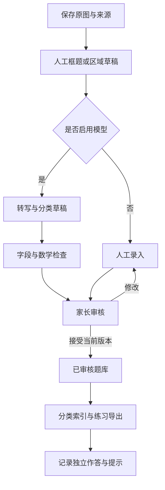

# 大模型 API 与 agent 可行性评估

2026-10-04 补充：用户同意 [SOP／前端／Workbench 融合方案](integrated-workflow-technical-plan-20261004.md)及本机实施。固定业务工作流是底座，agent 是可选内容辅助，skill 不等于服务端 agent；人工录入、查询、记录和导出不依赖模型。原四种任务外新增 material 资料内容草稿，单次外部请求及最多四个受控工具请求；资料批次累计四次、600 秒和配置预算冻结于 [核心补齐契约](fusion-completion-contract.md)。下文 6 请求／8 工具等属于原始提案，不是当前实现上限。没有安装自治 agent 框架或验证真实供应商效果；本机合成运行与真实外发分开记录。

日期：2026-10-01。证据层级：官方文档调研＋现有项目资料核对；没有调用付费推理 API、上传孩子照片、安装 agent 框架或跑识别基准。文档宣称的能力与本项目实测效果分别记录。

## 1. 结论

项目可以接入多模态大模型 API，并通过有限工具调用协助整理题目、分类和检查。建议采用 Django 业务应用、可替换模型接口、明确的处理步骤和一个有调用限额的 agent。正式数据、身份权限、审核、预算和导出仍由应用负责。

可行不等于可全自动：模型支持图片不能证明能正确识别所有密集分式；合法 JSON 不能证明数学正确；从照片中看到正确解答不能证明孩子独立掌握。[OpenAI 图片限制](https://developers.openai.com/api/docs/guides/images-vision#limitations)与[结构化输出说明](https://developers.openai.com/api/docs/guides/structured-outputs)均明确存在内容错误的可能。

## 2. 能力分工

| 环节 | 推荐执行者 | 输出与局限 |
| --- | --- | --- |
| 原图保存、去重、版本、权限 | 应用代码 | 校验值、稳定 ID 和版本；不交由模型决定 |
| 版面及题目区域 | 人工框选起步；OCR／视觉模型提出候选 | 坐标是草稿，必须能人工调整；精确定位待实测 |
| 题干／公式转写 | 视觉模型或 OCR；模型可协助修订 | 原始结果与修订分开；保留看不清的标记 |
| 方法分类、知识总结 | LLM 根据已审核题目与现有六组体系生成 | 主分类及辅助方法要引用具体题目，人工纠正 |
| 解题、勘误和错误步骤 | LLM 草稿＋确定性数学工具＋人工核对 | 记录检查范围；有限数值代入不能冒充一般性证明 |
| 作答独立性、笔迹来源 | 家长记录 | agent 不凭字迹、对错或整洁程度猜测 |
| 复习建议与变式 | 后续 LLM 草稿＋已有作答证据 | 新题必须经过检查，排期可手工修改 |
| PDF／Word 导出 | 现有渲染模块及应用代码 | 使用经过审核的内容快照，防止模型临时改题 |

三条候选识别路线需要用同一份人工核对样本比较：直接视觉模型；本地 OCR 后接文本模型；本地 OCR 与视觉模型对照。首版不同时建设三套生产流程。

## 3. 供应商候选与已核实能力

| 候选 | 官方证据 | 项目判断与尚缺验证 |
| --- | --- | --- |
| OpenAI API | Responses 支持图片输入；支持结构化输出和 function calling，strict 模式约束工具参数结构 | 可作为基准候选；账号可用型号、地区、延迟、数学效果和价格尚未实测。JSON 合法不替代业务检查 |
| DeepSeek API | 当前 Vision 文档明确 `deepseek-flash` 接收图片；工具调用文档包含 strict Beta 及其 schema 限制 | 可纳入直接视觉和工具调用对比，不能沿用其只支持文本的旧假设；Beta／端点差异需单独探测。普通 JSON Output 页面本轮抓取失败，未据此确认所有结构化能力 |
| 通义千问／阿里云 Model Studio | 文档提供视觉输入和工具调用；结构化输出区分 JSON Object 与 JSON Schema，并列出不同支持范围 | 是候选供应商；需对同一个具体型号验证图片、schema、工具调用及思考模式组合，不把系列层面的支持拼成一个型号的能力 |

来源：[OpenAI Vision](https://developers.openai.com/api/docs/guides/images-vision)、[Structured Outputs](https://developers.openai.com/api/docs/guides/structured-outputs)、[Function Calling](https://developers.openai.com/api/docs/guides/function-calling)；[DeepSeek Vision](https://api-docs.deepseek.com/guides/vision/)、[Tool Calls](https://api-docs.deepseek.com/guides/tool_calls/)；[Qwen Vision](https://www.alibabacloud.com/help/en/model-studio/vision)、[Function Calling](https://www.alibabacloud.com/help/en/model-studio/qwen-function-calling)、[Structured Output](https://www.alibabacloud.com/help/en/model-studio/qwen-structured-output)。

默认接口保留供应商替换能力，首个实现只接一个供应商。当前没有收到供应商及预算选择，不预先锁定模型，不声明某家便宜或效果最好。Chat Completions／Responses 的兼容描述不能代替逐项能力测试。

模型适配器至少表达：供应商、端点、模型 ID、支持的输入类型、结构化输出方式、工具调用能力、用量字段、请求标识及标准化错误。模型、提示词或 schema 更新后重新跑固定样本；缓存不能继续冒充新版本结果。

## 4. Agent 与工作流的选择

[Anthropic 的工程说明](https://www.anthropic.com/engineering/building-effective-agents)区分预定步骤的 workflow 与由模型动态选择步骤的 agent，并建议从简单可组合的方案开始。基于这一点，本项目采用固定业务步骤，并在明确环节内允许模型选择有限工具。这是项目设计判断，不是供应商对本项目效果的保证。

| 方式 | 适用性 | 本项目建议 |
| --- | --- | --- |
| Python 工作流＋供应商 SDK／HTTP | 少量明确阶段、领域数据由 Django 管理 | 首版默认；复用数据库任务状态和成熟任务执行组件，避免另写通用 agent 平台 |
| LangGraph | 存在较复杂分支、恢复、人工中断与多个运行节点 | 后续若现有状态管理明显不够再引入；生产恢复需持久化 checkpoint，内存示例不等于可恢复服务 |
| Dify | 可视化搭建流程、试验提示词及通过 API 暴露应用 | 可用于试验，但不会自动补齐题目版本、笔迹来源和学习证据模型；额外部署与授权需评估 |

框架来源：[LangGraph Persistence](https://docs.langchain.com/oss/python/langgraph/persistence)、[Dify Key Concepts](https://docs.dify.ai/en/learn/key-concepts)。目前未安装、选定或部署这些框架。

## 5. 首版处理步骤与工具边界

agent 可申请的工具示例：读取指定版本题目、获取已授权区域、查询方法标签、执行受限数学检查、提交草稿。它没有任意 shell、SQL、文件系统、外部网络或“直接批准题目”的工具。

工具调用只提出请求；服务端验证参数、资料归属、输入版本和剩余额度后才执行。题面、手写批注和 OCR 文本都属于待分析数据；其中“忽略之前要求”等文字不能改变工具权限或审核规则。

数学检查从有理数算术、有限求和等明确表达式范围开始，采用受限语法和计算资源上限。不能对模型输出使用不受限的 `eval` 或直接执行其生成代码；超出支持范围返回“未验证”。数值检查、恒等变形证明与人工判断分别标注。

初始工程限额提案：每个题目处理运行最多 6 次模型请求（包含重试）、8 次本地工具调用、180 秒主动处理时间；单次模型请求超时 60 秒，每节点最多一次自动重试且仍计入总限额。人工待审核不占用运行线程或这些计时。限额不是已测性能承诺，可在基准后按任务类型调整，由服务端配置而非模型修改。

工作流状态建议：`queued → running → needs_review → accepted/rejected`；失败、取消和过期结果另记 `failed/cancelled/stale`。节点完成结果持久化；恢复时检查输入版本与已完成步骤，不能无条件重新发起所有模型请求。

任务绑定输入题目版本、区域版本、分类规则、模型配置和外发配置版本。模型配置保留供应商、实际模型、prompt 与 schema 的快照。审核与草稿应用均执行服务端版本比较；迟到结果或过期审核请求只能保留为历史草稿。模型自己返回的“审核通过”文字不改变状态。已有人工确认记录不会因为换了模型就自动失效。

## 6. 可靠性与费用

每次模型调用记录输入资料版本、供应商、模型、prompt/schema 版本、参数、工具结果摘要、延迟、用量及请求标识。保存足够复查依据，不要求保存隐藏推理链。原始模型响应按私有数据管理，不默认上传到第三方 trace 平台。

结果缓存键至少包含家庭范围、输入内容与区域哈希、题目版本、模型、提示词和 schema 版本。原图、题干、分类规则或模型变化会使相应结果失效；不跨家庭共享含个人信息的缓存。

预算设置包括单题、每批和每月限额，运行前预估、发起调用前预留、收到用量后结算。并发任务共享预算控制，重试和复核也计费；超限只停止后续 AI 调用，人工流程继续可用。

首个供应商使用单一结算币种，不将不同币种额度直接相减。每次调用配置输入规模和最大输出限制，以计价规则估算可接受上界并原子预留额度；无法确定费率或上界时不启用硬预算下的付费调用。月周期、时区、预算归属和价格版本由配置明确。

费用估算使用供应商实测计量：未缓存输入、缓存输入、输出和额外工具费用分别按对应费率计算；图像若已计入输入 token 不再重复计价。费用记录带价格版本和币种，不承诺跨供应商完全一致的 token 计数。月预算和实际费率尚未确定，本轮不虚构月费估计。

重试目标是避免重复业务记录；供应商已经处理但响应丢失的请求可能产生重复计费。应保留请求状态和费用不确定项，能查询时先查询，不能查询时遵守重试上限。

请求结果未知或缺少用量时，标记 `unknown_charge` 并保留预留额度，不按零费用结算；取得对账依据或由维护者记录人工结算后再调整。测试至少包括并发预留、跨月结算、取消后的迟到响应、重试及用量缺失；调用限额不能被重试或供应商切换重置。

## 7. 数据外发与运行配置

原图与学习记录默认保存在自有存储；启用某个模型供应商时明确允许发送的图片区域、题干或过程文本。界面显示本次外发范围，去除无关姓名及页边信息，不把完整资料库作为默认上下文。

首次启用云端时展示供应商、数据类别及已知留存方式。外发配置包含允许的供应商／网关及已知上游、数据类别、配置版本、设置者和确认时间；每个任务绑定配置并显示本批实际范围。已确认范围内正常调用无需逐题反复确认；更换上游或扩大数据类别需更新配置。家长可关闭后续外发，每次实际发送前重新检查启用状态，排队任务及重试也遵守；关闭不等于撤回已经发出的数据。agent 不能自行改配置，也不能通过 URL 或日志平台绕过范围限制。

API 密钥仅进入服务端受保护配置；保留人工模式，不要求用户将密钥写进聊天、文档或 Git。当前只研究文档，不需要密钥。

OpenAI 官方说明 API 数据默认不用于训练，除非主动选择共享；同时默认滥用监控日志可保留客户内容，ZDR 需符合条件。应用状态与滥用日志是不同存储层，不能把一个 `store` 开关描述为全面零留存。其他供应商和自建中转需要分别核对，不能套用 OpenAI 政策。[OpenAI Data Controls](https://developers.openai.com/api/docs/guides/your-data)

如果使用自建网关，需同时核对网关日志、上游供应商、模型路由和能力差异；网关协议兼容不能证明识别质量、schema 严格性或隐私设置一致。

部署配置分别声明原图、派生图、模型原始响应、日志和备份的保留周期；未设置时禁止定时永久清理。归档不等于删除，永久清理要显示关联影响。本地删除不立即清除过往备份；恢复旧备份时需核对恢复点之后的删除记录，记录缺失时资料先保持不可见，由家长核对后再开放。云端文件删除接口和供应商日志留存单独核对，不承诺本地删除等于上游零留存。

## 8. 可行性验证方案

1. 建立少量人工核对样本，覆盖现有六组和关键困难情形；开发集与保留集按整页隔离。
2. 先做无外部调用的适配器契约测试：无效 JSON、缺引用、拒答、超时、429、取消、预算耗尽和未知工具。
3. 完成供应商、数据外发范围与预算配置后，选两个候选做相同样本对比；第一轮不铺开所有模型。
4. 分别评估区域定位、转写、分类、算术／解析和修订时间；报告失败样例、用量和延迟。
5. 只把通过检查并人工接受的内容纳入已审核题库；第二个模型的同意不能绕过这一步。

可立即推进的是需求、数据格式、离线验证与现有渲染模块整理。具体供应商选择、OCR 替代程度及 agent 带来的净收益，都需要上述基准后再下结论。
