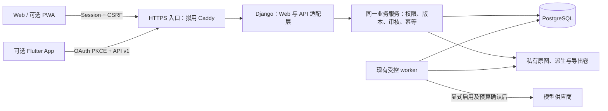

# 移动客户端技术方案与上线评估

评估日期：2026-10-04（Asia/Shanghai）。本方案的评估阶段仅授权只读调研及文档更新，用户确认“家庭自用优先，保留未来上架路线”。该阶段没有安装 SDK／依赖、开发应用／API、迁移、修改 36、调用模型、外发照片、提交／推送或部署。

同日后续进展：用户同意 MOB-01 后，HTTPS 覆盖配置与最小 PWA 已实现并通过本机合成隔离浏览器验收，见[实现、操作与验收说明](mobile-deployment.md)及 [DEV_STATE](../DEV_STATE.md)。同日另获同意后，源码已 push，36 的 HTTPS／PWA 及前后备份恢复已通过；Android／局域网 IP＋私有 CA 已固定。实体手机／主屏幕安装未执行；Flutter／原生 API／完整离线／公开发布仍是设计建议。下方评估基线保留为决策依据，不代表后续阶段均已实现。

## 1. 建议与交付形态

保留现有 **Django／PostgreSQL／Docker Compose 服务端及 Web 管理端**。家庭首次移动交付优先完善 HTTPS 和手机浏览器使用，再提供最小 PWA：从主屏幕打开同一套 Web 页面。实体手机试用确认操作痛点后，若需要独立安装包、相机集成或更完整的本地草稿，独立 App 推荐 **Flutter／Dart**，通过版本化 API 使用同一个服务端。

PWA 是家庭试用的低成本路线；Flutter 是独立 App 的技术建议。两者不要求全部开发：若后续明确独立 App 是必需交付，可跳过 PWA 外壳，直接做 HTTPS、API 与 Flutter。现有 Web 管理端继续用于复杂录入、审核、知识维护、打印和运维。

第一版原生客户端按**在线使用、家长账号、少量完整业务流程**设计。完整离线编辑、多设备同步、平板手写画布、推送、公开注册及商业多租户分别评估，不能由“做 App”自动纳入当前 M1。容器化交付的是服务端；手机安装包或 PWA 是另一种交付物。

以下选型为主代理根据现有项目作出的判断。引用的官方文档说明组件能力与发布条件，不能代替本项目的兼容性、真机或安全验收。

## 2. 评估时基线及与目标的差距

评估阶段读取当时文件和差异；源码基线为 `334ed893b4cf8d5a4a597ad5852e158172c5596c`，36 的已记录运行源码为 `ce698f9891d9c8bb609cde82c282a177074b31b0`。评估阶段不重新部署或重跑既有工程验收，既有结果及真实试用缺口见 [DEV_STATE](../DEV_STATE.md)、[需求实现核查](requirements-implementation-audit-20261003.md)和[补齐记录](gap-closure-20261003.md)。

| 层面 | 评估时已核实 | 移动交付需补充 |
| --- | --- | --- |
| 业务／数据 | 版本化知识、题目、原图区域、作答及评价；家庭权限、审核、幂等服务 | 将同一业务服务暴露为稳定 API，不能另造简化业务模型 |
| Web | Django 模板；Session／CSRF；已有手机宽度浏览器工程验证 | 实体 Android／iPhone 试用；安装入口、断网提示及 HTTPS |
| 客户端 | 无原生客户端、PWA manifest 或专用离线同步协议 | 选定平台、最小流程、设备和分发方式后新增 |
| API／登录 | 现有页面及少量 JSON 接口，非完整原生 API | `/api/v1/`、OpenAPI、原生登录／令牌撤销和版本兼容 |
| 图片 | JPEG／PNG；原字节不变；手动四角度预览／坐标映射 | HEIC、超限照片、相机选图行为、旋转及内存的真机验证 |
| 容器 | Web、worker、PostgreSQL 16；持久化卷；已记录备份恢复验收 | TLS 入口、日志轮转、容量和手机接入验证 |
| 构建发布 | Python 依赖固定；无已跟踪 `.github/` 工作流 | 合成数据 CI、移动构建、签名、版本清单与发布审批 |
| 人工／AI | 实体手机、真实家庭流程和真实供应商测试仍待执行 | 移动端验收不替代这三项；模型继续默认关闭 |

源码依据：`requirements.txt`、`app/settings.py`、`app/production.py`、`compose.yaml`、`app/web/{images,uploads,services}.py`、`app/persistence/{models,services}.py` 及现有业务契约。需求仍为 v0.2 的 18 FR／6 NFR／24 AC；v0.1 Luna 独立评审与 v0.2 主代理复核的状态不变。本方案不是需求新版或独立评审结论。

## 3. 客户端路线比较与选型

下表的工作量为相对判断，不是已测成本。

| 路线 | 对现项目的复用 | 能力及代价 | 建议 |
| --- | --- | --- | --- |
| 手机 Web／PWA | 复用 Django 页面、Session／CSRF 和业务服务；新增工作最少 | 主屏幕入口、同站更新；相机、后台任务和本地存储受浏览器约束；安装不等于离线能力 | 家庭试用优先；不要求原生包时可作为长期客户端 |
| Flutter／Dart | 复用后端业务／API；界面须重新实现 | Android／iOS 共享主要客户端代码；相机、文件、凭据插件需验证；增加移动 SDK、签名及发布维护 | **独立 App 默认建议** |
| React Native／Expo | 复用后端；当前没有可直接复用的 React 客户端 | 适合已有 React／TypeScript 技能的团队；同样需要 API、原生权限、构建和插件验收 | 团队已有明显 React 优势时替代 Flutter；不默认绑定外部付费构建服务 |
| Capacitor | 可复用 Web 交互思路 | 提供 Web 容器及原生插件；当前是服务端模板，不能认为直接打包就得到可靠离线 App；还须处理导航、登录和插件边界 | 只需少量原生能力且愿意采用 Web 客户端架构时再选 |
| Kotlin／Swift 双原生 | 复用后端；两套界面与平台工程 | 平台控制最直接，双平台实现和维护成本最高 | 单平台明确或出现跨平台无法满足的功能时再评估 |

官方依据：[PWA 安装条件](https://web.dev/articles/install-criteria)、[Flutter 安装与平台](https://docs.flutter.dev/install)、[React Native 开发环境](https://reactnative.dev/docs/environment-setup)、[Capacitor 文档](https://capacitorjs.com/docs)。选择 Flutter 是对本项目的工程判断，尚未做插件或原型实测。

## 4. 系统架构与复用边界

这是目标架构；MOB-01 只实现 Web／PWA 的 HTTPS 入口，图中的原生客户端、API 与 OAuth 层尚未实现。

服务端是正式记录的权威来源。客户端只展示、录入、暂存和提交操作，不自行判定审核状态或独立掌握。原图、模型密钥、数据库和费用控制留在服务端；客户端不直连数据库或模型供应商。知识体系的人工维护及有来源的 AI 草稿沿用现有流程，客户端不另做一套知识生成 agent。

初期沿用单机 Compose、PostgreSQL 和私有文件卷。没有新增 Redis／Celery、Kubernetes、对象存储或微服务的已验证必要性；出现队列积压、多机需求或容量瓶颈，再依据测量结果评估。

## 5. 拟用组件与版本管理

| 用途 | 建议组件／方式 | 当前状态与实施门槛 |
| --- | --- | --- |
| 后端 | 保留 Django 5.2 LTS、PostgreSQL 16 | 当前运行基础；不为移动端重写服务端 |
| API | Django REST Framework，薄适配层 | 未安装；依赖兼容、权限和异常映射验证后固定版本 |
| 接口文档 | drf-spectacular，OpenAPI 3 | 未安装；生成契约及客户端 DTO，审查版本差异 |
| 原生授权 | Django OAuth Toolkit，Authorization Code＋PKCE | 未安装；仅原生路线需要；先完成安全流程实测 |
| 原生 UI | Flutter／Dart；View／ViewModel／Repository／API Service | 未建立工程；先做选图、登录和坐标小原型 |
| 状态管理 | 首版用简单可测试 ViewModel；确有复杂共享状态再选扩展库 | 不预先引入多套状态框架；正式业务规则仍在后端 |
| 凭据／文件 | 系统 Keychain／Keystore 的受维护插件；受保护应用目录 | 插件名称、版本、许可、备份行为和真实设备结果待确认 |
| 离线队列 | 后续需要时用 SQLite 与明确的加密／密钥方案 | 首版不建完整离线数据库；SQLite 本身不等于加密 |
| TLS／PWA | Caddy 同源反向代理与最小 PWA | MOB-01 已通过隔离及 36 运行验收；Android 真机信任／安装未验，原生回调后续另验 |

[DRF](https://www.django-rest-framework.org/) 支持 API 适配与权限组件；[drf-spectacular](https://drf-spectacular.readthedocs.io/en/latest/readme.html)提供 OpenAPI 生成；[Flutter 架构指南](https://docs.flutter.dev/app-architecture/guide)支持界面、状态和数据访问分层。采用这些组件后仍须调用现有服务，不能用通用 ModelViewSet 直接更新修订、审核或证据表。

实施时固定 Flutter SDK、Dart／插件锁文件、Python 依赖与容器基础镜像；记录许可证、源码提交和构建环境。文档中的库名不表示当前已集成，也不以“最新版”作为可重复构建输入。

## 6. 首版客户端范围

| 客户端 | 建议提供 | 保留在 Web 管理端或另阶段 |
| --- | --- | --- |
| PWA | 现有人工流程、主屏幕入口、明确断网提示；实体手机使用修复 | 不自动增加私人数据离线缓存或原生功能 |
| 原生 App 首版 | 连接自有服务／登录；题目与知识关联浏览；照片逐张上传及来源框核对；学习者与逐次作答历史；新增作答／评价草稿；查看审核结果；下载并系统分享已有导出 | 首轮正式审核、复杂知识维护、合拆题、派生批处理、模型配置／发送、复习计划编辑与运维先用 Web |

首个原生纵向流程：**登录 → 查题 → 核对原图区域 → 记录一次作答草稿 → Web 审核 → App 回看新旧历史**。随后再扩展拍照上传和评价录入，避免一次复制全部管理页面。App 显示的“已上传”“已保存草稿”“已审核”须区分；失败或状态未知不能显示完成。

学习者档案不等于孩子必须拥有登录账号。首版按家长使用设计；若将来增加孩子模式，应先确定阅读／作答权限和服务端授权。隐藏按钮不是权限控制。平板直接手写涉及画布、笔迹数据和独立证据采集，另立需求，不能把上传纸上作答等同于电子笔作答。

## 7. 版本化 API 契约草案

以下全部是**拟定接口**，当前不存在这些完整路由。先冻结 DTO、错误与权限，再实现；接口示例使用虚构身份，不包含真实资料。API 版本与 `study-workbench.core.v0.1` 领域版本、渲染器版本及 App 版本分别记录。

| 拟定接口组 | 输入／输出及关键约束 | 顺序 |
| --- | --- | --- |
| `GET /api/v1/capabilities` | API 版本、最低客户端版本、上传限制、可用功能；不返回密钥或供应商私有配置 | 第一批 |
| `GET /api/v1/me` | 当前用户、可访问家庭及角色；账号活跃状态 | 第一批 |
| `GET /api/v1/households/{h}/questions` 与 `questions/{id}` | 游标分页；精确题目修订、审核投影、知识／方法／题型关联及来源缺口 | 第一批 |
| `GET .../knowledge/{id}`、`regions/{id}` 与 `assets/{id}` | 知识反查题目；区域精确修订、原图 SHA、尺寸、预览转换；鉴权后读取文件 | 第一批 |
| `GET .../learners/{id}/attempts`、`attempts/{id}` | 同题多次作答及各自修订、评价；日期／提示／独立性未知明确返回 | 第一批只读 |
| `POST .../attempts`、`attempts/{id}/revisions`、`assessments` | 操作 ID、精确问题／作答修订、来源、预期版本；追加草稿，返回收据 | 第二批写入 |
| `POST .../materials`、`materials/{id}/pages`、区域草稿 | 幂等创建；逐张上传；服务端校验及原图回执，不接受客户端自行声明文件已核实 | 第三批 |
| `GET .../exports/{id}` | 已生成版本、用途、SHA 与受保护下载；不从客户端重排正式 PDF／Word | 第三批 |
| 模型任务及正式审核接口 | 后续另定义来源、预算、确认、过期结果及审核依赖；首版原生不开放发送 | 后续 |

契约约束：

- 传递稳定 ID、精确 revision ID、原图 SHA 和来源区域，不能以显示名称或“最新题目”代替历史引用。当前已发布版本、编辑头与最新审核决定分别返回。
- 请求身份取自登录态／令牌，不能信任 payload 中的 `actor` 或家庭 ID。每个对象与文件都校验家庭权限；`owner`／`reviewer`／`viewer` 沿用当前模型，API scope 只增加限制，不替代对象权限。
- 所有写入携带持久 `request_key`，映射已有 RequestReceipt；同一操作重试用同一 key 与内容，返回同一结果。不同内容复用 key、账号变更复用或过期依赖拒绝，不能产生第二次作答或重复费用。
- 录入“另一轮作答”创建新身份；订正已录内容追加该作答修订；评价绑定精确作答修订并独立追加。统一的 `PUT question.answer` 不符合本项目契约。
- 客户端提供 `expected_heads`／必要依赖令牌，服务端在事务内重查，冲突返回 `409` 和可重新读取的对象标识；不自动覆盖或合并审核后的文本。客户端未知字段的兼容和枚举扩展策略在 OpenAPI 中明确。
- 读 API 可先适配既有查询，但不能一次把整个家庭所有原图／学习历史发到手机；验证分页、筛选与查询成本，必要时增加权限受控的只读投影查询。
- 统一错误结构包含稳定 `code`、可读说明、追踪 ID、必要字段错误；不返回堆栈或私有路径。区分 `401`、`403`／防泄露的 `404`、`409`、`413`、`415`、`429` 和暂时性故障。
- 时间使用带时区的 ISO 8601；实际作答日期及“未知”与系统记录时间分开。空字符串、缺失和未知状态不能相互替代。
- 私有预览／原图／导出通过鉴权文件接口读取，响应 `no-store`；Flutter 文件下载显式带授权并限制同源重定向，不把令牌放 URL 或跨站发送。客户端缓存键至少包含服务 origin、账号、家庭、对象与修订。

API 应复用 [核心数据契约](core-data-contract.md)、[持久化契约](persistence-contract.md)、[业务 Web 契约](business-web-contract.md)与[打印契约](export-contract.md)。原生适配若需要重构 Web 专用签名选择令牌，由主代理先定义共享选项／冲突接口，Web 和 API 一起验证，不绕过既有依赖校验。

## 8. 登录、权限与服务连接

Web／PWA 继续使用同源 Session、CSRF 和现有登录，不为 PWA 引入令牌系统。原生 App 建议用 Django OAuth Toolkit 提供 OAuth 2.0 **Authorization Code＋PKCE S256**，通过系统浏览器打开自有服务登录；原生 App 是 public client，包内不放 client secret。系统浏览器与 PKCE 依据 [RFC 8252](https://www.rfc-editor.org/info/rfc8252/)；[OAuth Toolkit 设置](https://django-oauth-toolkit.readthedocs.io/en/latest/settings.html)提供相应策略配置，不能照抄 confidential client 示例。

实施验收必须包含：精确回调 URI、`state`／PKCE 校验、禁止通配回调和任意跳转、受信服务地址、短期 access token、refresh rotation／reuse protection、设备注销与服务端撤销、停用账号或移除家庭成员立即拒绝。先建议 access token 15 分钟、refresh 最长 30 天，作为待验证参数；过期与闲置期限由最终策略配置，不能认为库默认值已经满足要求。

移动凭据用系统受保护存储；日志、URL、普通偏好设置和明文 SQLite 不保存令牌。刷新请求由一个会话管理器串行执行，避免多个请求同时使用旧 refresh token；响应丢失与重用检测需要真实反例测试，不把认证失败当作无限重试理由。服务端使用可撤销的 opaque token 即可，初期没有 JWT／外部身份平台的必要性。

每个自托管实例显式登记 Android／iOS 的 public client ID 与精确回调；client ID 是公开标识，不能赋予家庭权限，也不开任意客户端自助注册。服务地址可变时先评估固定应用自定义 scheme 配合 PKCE 的回调；固定域名分发时可评估验证过的 App Links／Universal Links。应用标识、签名与回调一致性列入原型验收，不在内嵌 WebView 中收集家长密码。

家庭端可手动选择自有 HTTPS 服务地址；先核对 origin，再登录，切换服务时清空认证上下文、隔离草稿并明确提示。不关闭 TLS 验证；不默认暴露公网或开放注册。扫码配置如后续采用，只承载经用户确认的服务地址及非敏感标识，不把密码或长期令牌写进二维码。

## 9. 照片、公式与来源坐标

当前 `app/web/images.py` 接受单帧 JPEG／PNG、单图不超过 1600 万像素；`uploads.py` 限制整个上传请求不超过 12 MiB，因此客户端须为 multipart 开销留余量。预览从新画布输出，不继承 EXIF；按手动 0／90／180／270 度旋转映射到原文件内在像素坐标。当前没有 HEIC 解码、分块断点续传或已验证的原生后台上传。

客户端必须统一使用服务端返回的原图尺寸、预览尺寸、旋转与转换关系；框选坐标先去除屏幕缩放、平移和留白，再映射到原始像素。屏幕 DPR、EXIF 镜像、系统相册自动转向及客户端裁切均不能偷偷改变基准。以四角度、贴边框、横竖屏、双指缩放／拖动和重新打开后的同一框做真机验收。

首版对 HEIC／超限文件明确提示并拒绝不受支持的格式，不能静默缩小后仍标成原图。若需要扩展，应新增“原文件接收＋受限解码＋可追溯派生”的设计：保留原字节／SHA，记录转换工具版本、参数及尺寸／方向映射，客户端确认后再关联题目。操作系统选图或相机插件若只给出转换后的文件，必须标明系统交付副本，不能声称获得相册原文件；其行为需插件原型证明。

解码和多张上传按队列逐张处理，不在手机或 Web 容器内同时解码整批高像素图。当前 Web 内存限额是配置值而非能力测量，须测真实照片的峰值内存、失败清理和超时再决定是否提高上限。后台切换时允许清楚显示中断／待重试，不承诺操作系统会无限后台上传。

题干／知识公式沿用受限公式结构，App 对不支持公式使用精确来源区域回退；不任意执行 HTML 或重写数学含义。正式 PDF／Word 仍由现有服务端生成；客户端只查看和经用户操作下载／分享，并说明离开应用后的副本由用户管理。

## 10. 在线优先与后续离线同步

首版在线读取正式记录、在线提交草稿。断网给出可恢复提示；未收到服务端收据的操作显示“待确认”，恢复连接后以同一操作 ID 查询／重试，不能新建另一操作。照片暂存明确标成待上传，只有拿到服务端文件及来源回执才显示已入库。

最小 PWA 的 service worker 如使用，只缓存指定的公开静态壳及通用离线页；登录页、私有 HTML、API、图片和导出不进入 Cache Storage，不覆盖当前 `no-store` 策略。注销清理会话相关客户端状态。PWA 安装能力不意味着有私人资料离线浏览或可靠后台同步。

完整离线能力若后续确有需要，单独实施以下协议：

1. 本地追加操作队列，包含服务／账号／家庭、操作 UUID、精确依赖修订、payload、照片 SHA 及状态；同一操作不因重启改变 UUID。
2. 逐步确认文件 → 来源区域 → 作答 → 评价等依赖；中途失败保留可恢复状态。禁止 last-write-wins、在离线端自行正式审核或更新掌握结论。
3. 服务端提供收据查询和受权限约束的变更游标／投影；这是新增协议，当前没有完整实现。冲突需展示新旧版本供人工处理，撤销权限后不能继续同步。
4. 本地敏感数据加密且密钥与文件分开管理；账号注销／设备丢失／重装／云备份的清理与恢复策略先定义。剩余草稿可由家长显式导出，不能静默清空。
5. 服务端恢复旧备份后，旧游标失效并发出恢复 epoch；重新核对操作收据和依赖。收据丢失时不得盲目重放可能已消费费用的模型任务；模型调用不进入首版离线队列。

## 11. 网络、部署与环境

家庭默认：36 上的单实例服务，经局域网或已有 VPN 访问。增加一个 HTTPS 同源入口承载 Web、API 和文件；数据库继续不对外发布。建议 Caddy，代理头只信任该入口，核对 ALLOWED_HOSTS／CSRF_TRUSTED_ORIGINS、Secure cookie 和重定向，不以禁用 CSRF、放开 CORS 或跳过证书校验解决连接问题。

证书方案需在实施前选定：有自有域名时可评估受信公开证书及 DNS 验证；无域名时可用私有 CA，但每台设备都需要正确安装并信任。Caddy 的本地 CA 不会自动让手机信任；容器内建立证书也不等于所有客户端可用，依据 [Caddy HTTPS 文档](https://caddyserver.com/docs/automatic-https)。评估阶段未进行这些变更；随后 MOB-01 已选择私有 CA 并部署 36，未改共享 DNS／VPN，Android 信任仍待真机操作。

| 环境 | 数据与配置 | 使用目标 |
| --- | --- | --- |
| 本机／CI | 虚构图片、账号、题目与假模型适配器；临时数据库／卷 | 单元、API、合成端到端和构建，不复制家庭备份 |
| 隔离验收实例 | 固定合成样例、独立项目名／卷、候选镜像 | TLS／OAuth／PWA／移动构建、升级和空实例恢复 |
| 36 家庭测试 | 已有私有运行目录和账号；版本与备份清单 | 获升级授权后执行；保留原记录，不用它做清空／重装测试 |
| 将来公开演示 | 完全虚构资料、单独身份与模型关闭配置 | 商店审核或公开演示，不能提供真实家庭账号／照片 |

配置按环境分离并显式选择服务地址；密钥、签名材料和真实数据不进入 public 仓库、CI 产物或 App 包。图片接口按权限返回，私有目录不作为静态目录发布。公开上架不自动意味着把家庭实例直接开放到互联网。

## 12. 安全、隐私与运维准备

- 默认仅索取当前操作需要的相机／选图权限；优先系统文件选择器，拒绝权限仍可浏览。照片作者、来源、提示和独立性不能由文件时间或账号自动推断。
- 手机、备份、服务器、外部模型及系统分享是不同数据流，分别说明保存和发送范围；原文件可能含 EXIF 定位信息，保持原样的策略不能解释为“全部图片已脱敏”。预览不带原元数据也不代表原文件可安全外发。
- 沿用已有外发声明、确认人／时间、完整模型配置快照及预算门槛。App 包不带模型密钥；真实供应商仍由用户以后手动配置测试。
- 初期不接入广告、外部行为分析或上传学习内容的崩溃 SDK。日志仅记操作类型、追踪 ID、状态和耗时，过滤认证头、原图路径、题干与儿童信息；支持包默认无资料内容。
- 增加日志轮转与容量检查，监测磁盘／备份年龄、HTTP 错误、重启／内存、队列延迟和模型不确定费用；不在监控平台展示真实作答。告警渠道与阈值待配置，不视为已实现。
- 公开分发前核对实际权限／数据流对应的隐私说明、商店数据披露、账号和家庭资料退出／删除机制。现有追加历史与家庭记录不能直接等同于“删除登录账号即删除所有资料”，应先设计引用、匿名化／删除和备份保留规则，再核对适用地区要求及商店规则。

## 13. 测试与验收计划

本节是后续实施验收条件，当前没有新增测试结果。沿用 [24 个需求验收场景](requirements.md)，下面增加移动交付维度，不变更原验收编号或宣称 M1 已完成。

| 编号 | 必须验证的结果 |
| --- | --- |
| MOB-AC-01 | 同一知识节点能查到题目及精确原图框；从原图反查题目及知识；历史版本仍指向原框 |
| MOB-AC-02 | 同题新增三次作答分别保存；每次评价及评价修订独立；App 与 Web 互查历史一致 |
| MOB-AC-03 | 课堂笔记、提示后完成、独立作答分开；来源／作者／日期不明、看不清和空白保留未知，不增加独立掌握结论 |
| MOB-AC-04 | 讲义勘误引用来源和依据；学习者错误及订正另外记录；不把两个事件合并成一个错误标记 |
| MOB-AC-05 | 跨家庭／viewer 写入、停用账号、成员撤销、过期／重复授权及文件 URL 越权被拒绝；授权头不泄露至外站 |
| MOB-AC-06 | 断网／超时／双击／重启同操作只产生一份记录；不同内容同 key 和过期依赖拒绝；失败不显示成功 |
| MOB-AC-07 | Android／iOS 真机选图、EXIF 方向、JPEG／PNG／HEIC、超限及损坏图、四角度缩放框选、返回重开均保持来源或清楚拒绝 |
| MOB-AC-08 | HTTPS、登录回调、token 刷新／撤销、账号／服务器切换、权限拒绝、注销无私有缓存符合契约 |
| MOB-AC-09 | 服务重建后数据／文件保持；配套备份恢复及版本回退演练通过；新旧客户端兼容或明确阻止不兼容写入 |
| MOB-AC-10 | 模型关闭仍能完成首个流程；未确认发送不能外发；导出用途、公式、来源和原历史文件不变 |

API 使用合成资料做权限、幂等、版本冲突和失败回滚测试；客户端做 DTO／状态测试、少量真实流程的端到端测试，避免镜像实现的重复用例。模型发送用假适配器，不为移动工程调用付费 API。

设备至少覆盖实际家庭 Android／iPhone 中将被使用的平台，另验证一台资源较弱设备或相应受限环境；具体机型／系统版本清单待确认。模拟器与 390×844 浏览器检查不能替代相机、系统相册、证书、凭据和后台切换的真机测试。若只交付 PWA，测试目标是移动浏览器，不宣称有原生 App 验收。

性能目标在固定测试图片、设备、家庭规模和网络条件后冻结；测冷启动、列表／预览耗时、峰值内存、上传耗时及错误恢复。本轮不给未经测量的容量或响应时间承诺。

## 14. 构建、发布与上线流程

### 14.1 源码和构建产物

新增合成数据 CI：领域／API 相关测试、OpenAPI 差异、Flutter 分析／测试／构建，以及镜像构建；开发分支使用 `codex/` 前缀。CI 不读 `data/`、`backups/` 或家庭凭据，不部署 36。主代理审查完整 diff，随后才按用户授权提交／手动 push；推送、发布镜像、设备升级及商店提交分别记录，不能互相代替。

服务端构建记录提交 SHA、镜像 digest、依赖、迁移清单与版本兼容范围；客户端记录版本名／构建号、提交 SHA、API 范围、SDK／插件锁文件和签名身份。Android keystore、iOS 证书／provisioning profile 及恢复材料受保护保存并另行备份，不提交仓库；固定 application ID／Bundle ID 后避免随意更换签名身份。

### 14.2 服务端上线顺序

1. 冻结候选提交／镜像和 API 契约，完成实际差异审查、相关测试及发布清单。
2. 在隔离空实例验证配置、TLS／授权、迁移、新旧客户端、业务流程及配套备份恢复；记录可回退版本和容量结果。
3. 得到 36 升级授权后，按现有 SOP 停止写入方、制作一致的 DB／文件备份并验证；记录镜像、配置和迁移状态。不能只复制正在变化的数据目录。
4. 升级与迁移，执行登录、私有预览、知识双向追溯、同题多次作答、旧评价／导出和模型关闭的运行复验；不以 `/health` 成功代替业务验收。
5. 失败停止新增写入并按兼容矩阵处理；成功制作升级后备份，更新部署清单和 DEV_STATE，再逐步开放手机试用。

不兼容数据库回退沿用旧镜像＋配套旧配置／备份恢复到独立空项目的方法；不能让旧镜像直接连接已升级数据库。迁移后新增数据如何保留须在升级前明确，恢复旧备份会失去其后的写入，不能描述为无损回退。

### 14.3 家庭客户端分发

PWA：确认设备受信 HTTPS → 浏览器登录 → 按该平台实际入口添加主屏幕 → 验证启动、更新、断网与注销。无需把 Web 包提交商店，仍有证书及服务维护成本。

Android App：开发调试真机 → 签名 release APK／内部测试 → 核对来源、签名和 SHA 后家庭安装 → 升级保留草稿／认证策略。若用 Play，再按账号与目标地区规则准备封闭测试等步骤。商店之外的安装／开发者验证规则也需在分发时核对，不能承诺永久无需注册；[Android 开发者验证官方说明](https://developer.android.com/developer-verification)列有 2026 起的地区分阶段安排。

iOS App：需要符合工具链要求的 Mac／Xcode 和真机；个人开发签名适合开发验证，不能当作稳定长期家庭分发。持续测试可评估正式账号、注册设备分发或 TestFlight 的适用条件；TestFlight 面向测试且遵循相应审核规则，不能假设它是永久免审私有渠道。工具与设备准备见 [Flutter iOS 设置](https://docs.flutter.dev/platform-integration/ios/setup)，测试分发规则见 [Apple 审核指南](https://developer.apple.com/app-store/review/guidelines/)。仅家庭自用且不需原生能力时，iPhone 可先用 PWA。

客户端与服务端发布分别控制。服务端先支持当前及上一已发布 App 的 API，客户端再更新；收紧最低客户端版本时先明确未同步草稿的处置。强制升级只能限制不兼容操作，不能静默删除本地数据。

### 14.4 将来公开上架

重新确认受众、国家／地区、隐私数据流和服务可用性，补齐隐私／支持页面、图标／截图、权限理由、审核说明、独立合成演示账号或获许可的演示方式；服务应在审核期间可访问。Apple 要求提供功能及审核访问，且简单重包装网站存在最低功能要求风险，依据 [审核指南](https://developer.apple.com/app-store/review/guidelines/)。家庭局域网服务本身不能证明审核人员可使用。

Google Play 新个人账号的生产发布还涉及测试资格；官方当前说明对 2023-11-13 后创建的此类账号要求至少 12 名测试者持续加入封闭测试 14 天，再申请生产访问，见[生产访问条件](https://support.google.com/googleplay/android-developer/answer/14151465)。账号类别和规则应在实际提交前重新核对。

公开分发与公开注册服务分别决策。若要服务多个家庭，另补注册／邀请、租户隔离、配额与滥用防护、支持、费用、资料退出／删除及灾难恢复需求，再决定是否开放；本方案不把当前 36 变成面向公众的运营平台。

目标商店及国家／地区目前未指定。上述 Google Play 条件不能直接套用到国内 Android 商店；未来选定渠道后，须分别核对开发者资质、签名／包要求、材料、隐私披露及当地上线要求，形成该渠道发布清单。

## 15. 备份、恢复与后续维护

沿用 [容器备份恢复 SOP](container-deployment.md)，增加发布清单、TLS／OAuth 配置和客户端签名恢复材料；家庭 DB／文件备份与源码备份分开。建议本机之外另有受保护且加密的备份副本，定期在隔离空实例恢复，不仅检查压缩包存在。

可先以 RPO 24 小时、RTO 4 小时作为待演练目标；当前没有证据证明达到这些目标。原生端未同步草稿不在服务器备份里，须明确设备损坏和恢复后的操作重放边界。恢复事件、备份点与影响范围进入私有运维记录；公开文档只记去敏状态。

定期检查证书续期、磁盘与备份、依赖／移动 SDK 安全更新、系统权限变化和商店规则；升级前运行受影响的 API／真机与恢复验证，不默认每次全量重测，也不凭未触发的告警认为系统可恢复。

## 16. 成本与准备清单

| 项目 | 家庭路线 | 原生／公开分发增量 |
| --- | --- | --- |
| 设备 | 复用现有服务器和真实家庭手机；先核对容量及平台 | iOS 需受支持 Mac／Xcode；必要时补测试设备，不先购买 |
| 服务 | 局域网／已有 VPN；域名／证书方案待选；备份需独立空间 | 公网实例、带宽、监控／支持及额外恢复容量另预算 |
| 账号 | PWA 不需商店账号 | Apple Developer Program 官方标价 US$99／年；Google Play 注册 US$25 一次性；地区币种／税费及条件以开通时为准 |
| 模型 | 默认关闭；现有系统供配置 | 用户以后手动实测和独立设费用上限；不是 App 开发的前置付费项目 |
| 工作量 | 真机流程／HTTPS／最小 PWA 较小 | API／OAuth 中等；原生主要流程较大；完整离线同步是独立大任务；上架增加材料、测试及维护 |

账号价格依据：[Apple 注册](https://developer.apple.com/help/account/membership/program-enrollment/)、[Google Play 注册](https://support.google.com/googleplay/android-developer/answer/6112435)，核对日期 2026-10-04。这里没有采购或开户动作。开发周期应在 MOB-01／API 原型验证后，按平台、离线范围与可用人力估算，不给当前无法支持的工期承诺。

实施前需补齐：实际 Android／iOS 机型与最低支持系统、是否具备受支持 Mac、域名／VPN／可信证书路线、App 是否必须、离线必要性、应用标识／签名负责人、家庭角色、备份目标与恢复负责人。家庭优先及未来保留上架已确认，其余未确认项不阻止这份评估，但相关实现需要先固定输入。

## 17. 分阶段任务与首个实施任务

MOB-00 评估、MOB-01 隔离实现及另获授权的源码交付／36 备份升级已执行；MOB-01 的真机未执行，其余任务仍为**待授权实施建议**。现有 T-06 家庭核定／耗时及实体试用、T-07 手动模型实测仍保留；移动交付不能把它们标成通过。需要家长或设备实际操作的条件也不能由代理补造结果。

| 任务 | 输入／文件责任范围 | 输出与验收 | 依赖 |
| --- | --- | --- | --- |
| MOB-00 本次评估 | 主代理：本方案、README／DEV_STATE／实施入口 | 技术决策、差距、API 草案、上线／恢复、下一任务；仅文档检查 | 本轮完成 |
| MOB-01 家庭 HTTPS 与最小 PWA | 主代理：`deploy/caddy/`、`compose.mobile.yaml`、`docs/mobile-deployment.md`；`app/urls.py`、`app/web/` 安装入口与匿名重定向 no-store，专用测试／隔离验收脚本 | 隔离、36 HTTPS 部署及备份恢复已通过；Android 真机证书／主屏幕安装未完成，不能判全部通过 | 已固定 Android 优先、36 局域网 IP＋私有 CA |
| MOB-02 API 与原生授权 | 主代理共享契约及配置；拟 `app/api/`、API 文档／OpenAPI、`tests/api/`；必要依赖／OAuth 迁移单独审查 | 首批只读与授权完整闭环；权限／私有文件／刷新撤销／版本契约；不绕过服务 | HTTPS；确认做原生 |
| MOB-03 Flutter 在线首个流程 | 拟 `clients/mobile/`；家长会话、题目／来源、作答草稿／历史；服务端写 API 主代理负责 | 真机完成第 6 节首个流程，重复提交／冲突／未知不误判 | MOB-02 |
| MOB-04 照片／评价与家庭验收 | Flutter 相关功能、API 适配及设备报告 | 真机上传／坐标／评价，MOB-AC-01～10 对适用范围通过；真实家庭确认另记 | MOB-03，格式原型通过 |
| MOB-05 离线（可选） | 同步契约、本地存储／队列、服务端游标及恢复 epoch | 断网／重启／冲突／备份恢复／权限撤销反例通过 | 确有离线需求且在线流程稳定 |
| MOB-06 构建与维护 | 合成数据 CI、签名／发布清单、备份／升级文档 | 可复现镜像与客户端包；来源、版本和空实例恢复通过 | 随实施逐步补齐，分发前完成 |
| MOB-07 公开分发（可选） | 演示环境、账号、商店／隐私材料、运营需求 | 实际分发及审核结果；不以材料齐全称已上架 | 家庭验收；另获发布授权 |

**MOB-01 的实施范围定义（隔离工程与另获授权的 36 交付已完成）**：输入是当前 Compose／production 配置、私有响应策略、既有人工流程和独立私有 CA；输出为可审查的 HTTPS／PWA 配置、证书信任步骤、设备操作说明及去敏报告。Android 优先及局域网 IP／私有 CA 入口已固定；没有改核心题目／学习模型、原数据卷路径或开启模型。

文件边界：配置覆盖文件与入口文档为主；manifest／图标／通用离线页放专用静态目录，路由仅添加安装相关入口。若使用 service worker，限制作用域和明确公开静态白名单，补注销及 no-store 反例。原始 `compose.yaml` 的存储和权限默认不动；如必要改动，主代理说明原因并检查完整差异。

验收：合成隔离实例的 HTTPS、可信代理、Session／CSRF、登录／私有图片／注销、安装与更新、断网提示通过；真实设备的证书与入口通过才称真机通过。复验一条知识↔题目↔原图及一条多次作答历史；确认 private HTML／API／图像／导出无 Cache Storage 副本，模型关闭、手机业务请求无第三方外发、原记录／原图 SHA 不变；证书签发／续期的必要外联按证书配置单独记录。隔离实例验完清理，不连接原服务；36 升级已在单独授权下执行，报告继续区分隔离、运行和未做的家庭真机验收。

后续获实施授权及委派授权后，可以分别分配 API DTO／移动单功能／测试工具给 luna6-worker；共享认证、领域契约、迁移及发布边界由主代理负责。每个 worker 明确文件所有权、输入输出与最小验收，告知不是唯一修改者，不得回退他人改动；主代理审查全部实际 diff 并独立验证。MOB-01 由主代理实施和验收，未新增委派；文档路线图不代表已获后续实施或发布授权。
